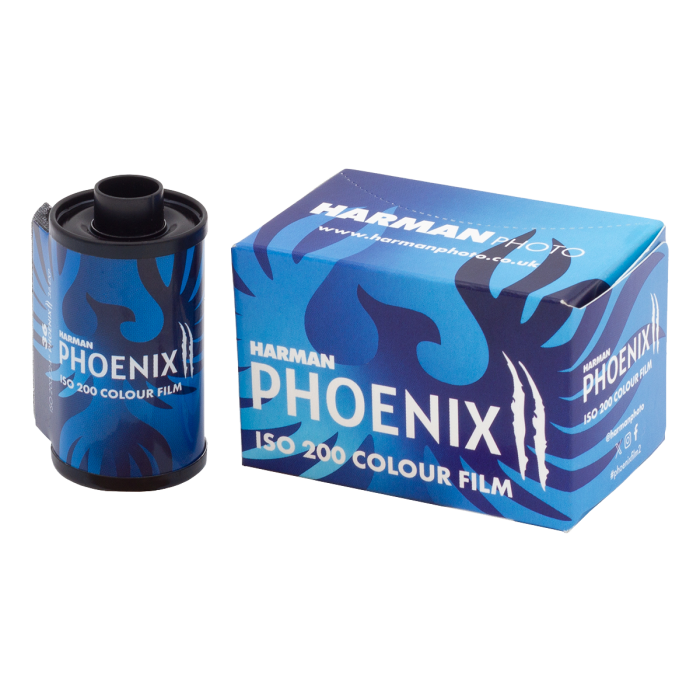
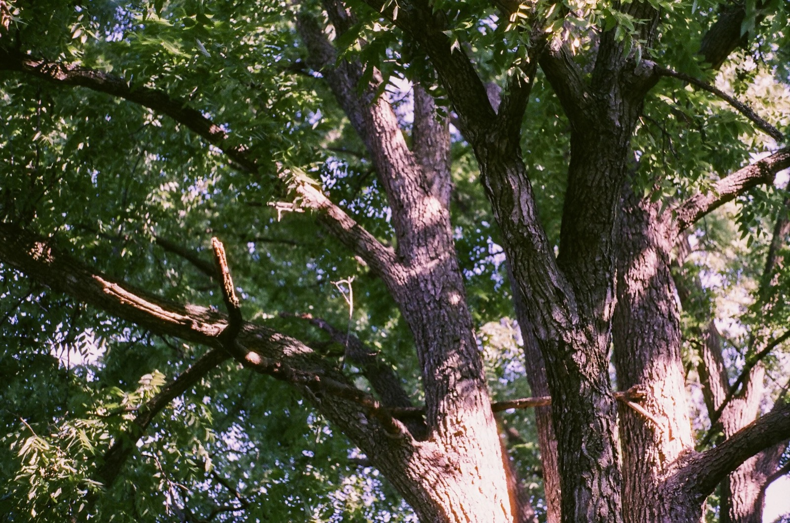
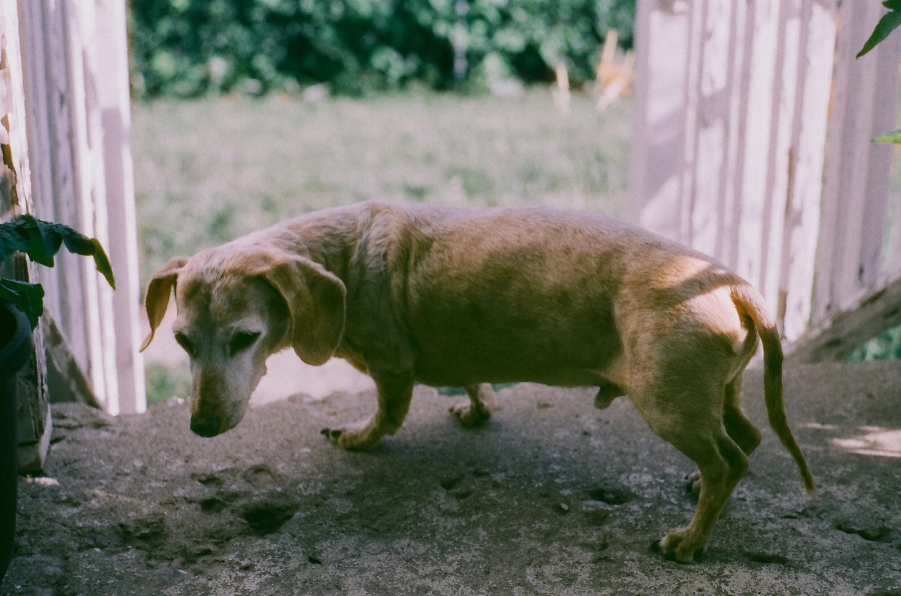
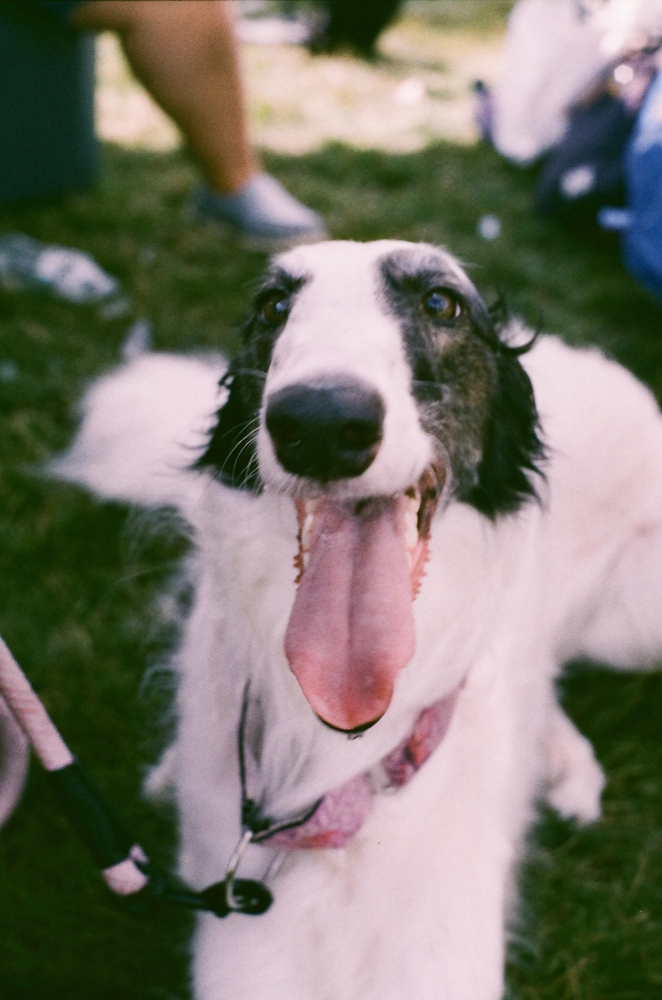
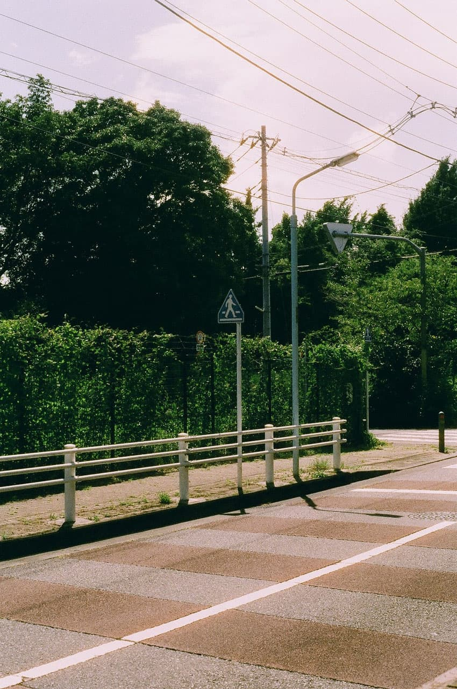
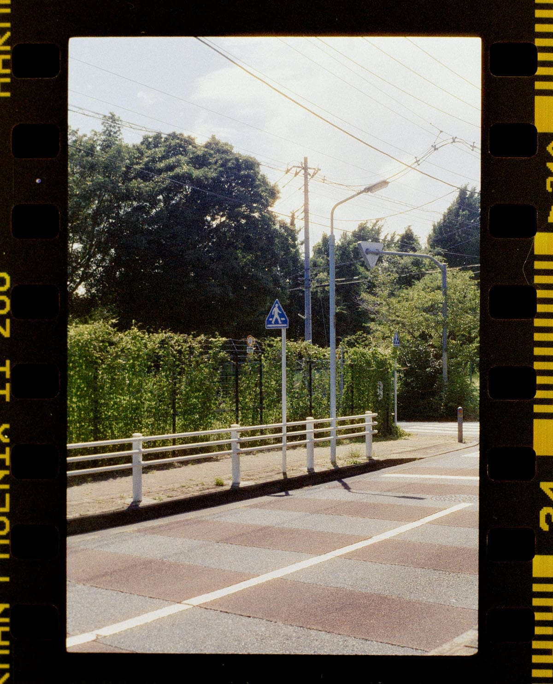
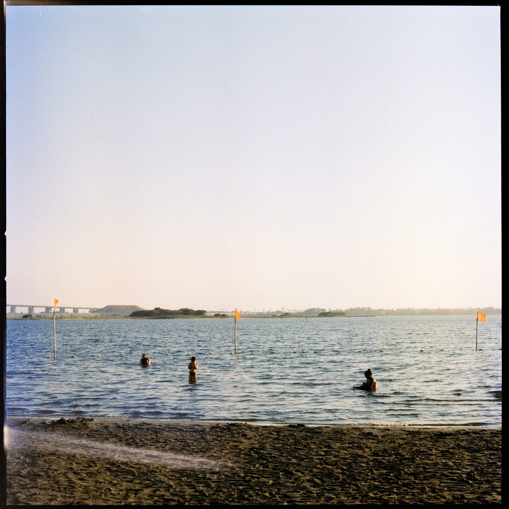

# HARMAN Phoenix II

Second-generation experimental colour negative from [HARMAN Photo](https://www.harmanphoto.co.uk/) (Mobberley, UK). Successor to Phoenix 200 (Dec 2023). Completely new emulsion — not a minor tweak of Phoenix I. Still sold as a creative / developmental stock, not a Portra substitute. Compiled 2026-07-30.

## Official specs

| | |
| --- | --- |
| **Type** | Colour negative, C-41 |
| **Box speed** | ISO 200 / 24° (DX-coded on 135) |
| **Practical EI** | Best ~**EI 100–200** (HARMAN); many shooters prefer slight overexposure |
| **Formats** | 135 (36 exp) · 120 (edge numbers 1–19) |
| **Base** | 0.125 mm / 5-mil acetate |
| **Mask** | **No orange mask** — processed negs look magenta/purple (normal) |
| **Push** | Not recommended |
| **Reciprocity** | No correction 1–1/10 000 s; longer: \(T_a = T_m^{1.31}\) |
| **UV** | UV filter on bright days recommended |
| **Made** | Entirely at HARMAN, Mobberley |
| **Hashtags** | `#phoenixfilm2` `#harmanphoenix2` |

Vs Phoenix I (HARMAN): more normal contrast/colour, finer grain, wider latitude, easier default scanning — still “different” vs mainstream C-41, can show **halation** in high contrast, still benefits from accurate exposure.

Alternative processes (E-6, ECN-2) are mentioned by distributors as experiments; official path is **C-41**.

Docs: [35mm product](https://www.harmanphoto.co.uk/harman-phoenix-ii-35mm) · [120 product](https://www.harmanphoto.co.uk/harman-phoenix-ii-120) · [technical sheet (PDF)](https://www.harmanphoto.co.uk/amfile/file/download/file/1968/product/2208/) · [FAQ](https://www.harmanphoto.co.uk/faq/) · [scanning tips](https://www.harmanphoto.co.uk/scanning-tips/)

## Scanning (official starting points)

No orange mask fools auto C-41 profiles. HARMANLab developed these with Darkroom.com, Analogue Wonderlab, SilverPan, Blue Moon Camera.

### Fujifilm SP3000

Defaults usable; better with a custom channel — Tone = **All Hard**, Saturation **+2**, C **−2** / M **0** / Y **0**, density as needed. Or scan as **reversal** and invert (NLP / Photoshop) for more control.

### Noritsu HS1800 / LS600 / LS1100

DSA: Overall Contrast **3**, Chroma **100**, Automatic Contrast 2 **5**. Colour start: C **+1**, M **0**, Y **−2**. Save a Phoenix II print channel (service menu).

### Epson flatbed

Full autoexposure + auto colour; or scan as slide and invert in NLP/Photoshop (HARMAN’s preferred home method).

### Digital camera / other

Normal camera-scan workflow + NLP/Photoshop invert. Auto exposure/colour on; sharpening low/off; maybe lower saturation ~30% if harsh.

## Community consensus

| Theme | Take |
| --- | --- |
| Vs Phoenix I | Clear upgrade: more usable colour, latitude, grain — still not “safe” consumer film ([Moment](https://www.shopmoment.com/articles/harman-phoenix-ii-film-review), [SIWF](https://shootitwithfilm.com/harman-phoenix-i-vs-phoenix-ii-film-comparison/)) |
| Exposure | Underexposure still ugly fast on 135; 120 more forgiving. Box speed OK in good light; many rate 100–160 |
| Look | Punchy/warm, visible grain, yellow/warm **halation** on bright edges; skin OK but not Portra |
| Lab scans | Hit-or-miss until labs load HARMAN channels — wild casts common ([SIWF](https://shootitwithfilm.com/harman-phoenix-i-vs-phoenix-ii-film-comparison/), [Nikon Cafe](https://www.nikoncafe.com/threads/harman-phoenix-ii-iso-200.367555/)) |
| Home / camera scan | Often closer to the scene; Marrash notes Noritsu midtone/shadow **yellow-green** even with updated data, needing LR work ([Marrash](https://marrash.com/blog/2025/7/16/harman-phoenix-ii-the-experiment-improves)) |
| Point-and-shoot | DX at 200 + lab auto-scan = frequent disappointment; manual cameras + collect negs |

Related (Phoenix **I** only): [Carmencita](https://carmencitafilmlab.com/blog/harman-phoenix-review/) Frontier vs Noritsu side-by-sides show how hard no-mask stocks punish default lab profiles — same failure mode still reported on II.

## Sample photos

Credits: [samples/SOURCES.md](harman-phoenix-ii/samples/SOURCES.md). Thumbnails resized by site build.

### Lab Noritsu (Mat Marrash / Midwest Photo)

### Same negative: lab scan vs home scan (Raufan Yusup / SIWF)

| Lab scan | Home scan |
| --- | --- |
|  |  |

Lab version: hotter sky/magenta drift, crunchier contrast. Home version: calmer colour, sprocket borders visible.

### Medium format (SIWF, Phoenix II 120)

## Practical checklist

1. Meter for mid-tones; outdoors in good light; UV filter on bright days.
2. Prefer EI 100–200; bracket until you know your camera/lab combo.
3. Tell the lab it’s Phoenix II / no orange mask — ask for HARMAN channel or reversal→invert.
4. Always collect negatives; re-scan if the lab JPEG looks nuclear.
5. Don’t expect Portra skin or Gold nostalgia — shoot it for character.

## Sources

- HARMAN: [product 35mm](https://www.harmanphoto.co.uk/harman-phoenix-ii-35mm), [120](https://www.harmanphoto.co.uk/harman-phoenix-ii-120), [datasheet PDF](https://www.harmanphoto.co.uk/amfile/file/download/file/1968/product/2208/), [FAQ](https://www.harmanphoto.co.uk/faq/), [scanning tips](https://www.harmanphoto.co.uk/scanning-tips/)
- Press: [Transcontinenta / Notified (2025-07-16)](https://newsroom.notified.com/transcontinentagroup/posts/pressreleases/harman-phoenix-ii-fresh-formulation-enhanced)
- Reviews: [Moment](https://www.shopmoment.com/articles/harman-phoenix-ii-film-review) · [Mat Marrash](https://marrash.com/blog/2025/7/16/harman-phoenix-ii-the-experiment-improves) · [Shoot It With Film](https://shootitwithfilm.com/harman-phoenix-i-vs-phoenix-ii-film-comparison/) · [Nikon Cafe thread](https://www.nikoncafe.com/threads/harman-phoenix-ii-iso-200.367555/)
- Phoenix I scanner context: [Carmencita](https://carmencitafilmlab.com/blog/harman-phoenix-review/)
