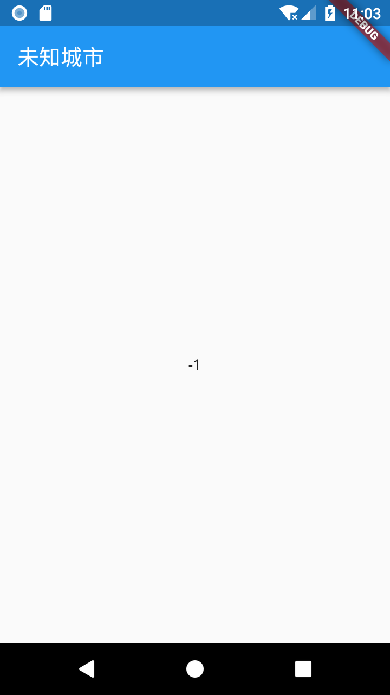

Flutter试玩
===========

## 安装依赖（Android Studio）

flutter依赖Android Studio解决Android平台支持，
即使你使用其他编辑器编写flutter程序，一样要装Android Studio。

64位Ubuntu上，Android Studio依赖一些32位库：

```sh
sudo apt install libc6:i386 libncurses5:i386 libstdc++6:i386 lib32z1 libbz2-1.0:i386
```

安装KVM（Android Studio依赖KVM实现虚拟机加速）：

```sh
sudo apt install qemu-kvm libvirt-bin ubuntu-vm-builder bridge-utils
```

至[Android Studio官网]下载zip包，解压至钟意的目录（比如`/opt`）。

[Android Studio官网]: https://developer.android.com/studio/index.html

访问`android-studio/bin/`，执行`studio.sh`。

初次运行会自行下载安装Android SDK，如遇到网络问题，会弹出代理设置对话框。

## 安装Flutter

由于网络原因，CN内需要使用镜像：

```sh
export PUB_HOSTED_URL=https://pub.flutter-io.cn
export FLUTTER_STORAGE_BASE_URL=https://storage.flutter-io.cn
```

从GitHub代码仓库安装：

```sh
git clone -b dev https://github.com/flutter/flutter.git
export PATH="$PWD/flutter/bin:$PATH" >> $HOME/.bash_profile
source $HOME/.bash_profile
cd ./flutter
```

关闭报告：

```sh
flutter config --no-analytics
```

运行`flutter doctor`检查依赖：

```sh
flutter doctor
```

### 配置开发环境

flutter官方推荐的开发环境是Android Studio和Visual Studio Code.
作为全家桶受害者，我选择Android Studio.

其实没什么需要配置的，只需安装一个`Flutter`插件。

还有就是Android开发常规的配置虚拟机：

1. 确保机器开了VM加速（如果机器不是太老的话，一般都开了）
2. Android Studio > Tools > Android > AVD Manager: 选择Create Virtual Device
3. 选择你钟意的机型（屏幕尺寸和Android版本），注意选择`x86`或`x86_64`版本，否则会很慢。如果你之前没使用过这个“机型”的话，需要下载镜像，请耐心等待。
4. 点Next继续配置，Emulated Performance选择**Hardware - GLES 2.0**开启硬件加速。
5. 点Finish创建。之后试着运行下，看看有没有问题。

然后跑一下自带的示例，看看能不能跑通。

1. File > New Flutter Project: 项目类型选Flutter application
2. 右上方工具栏选择刚才创建的虚拟机（如果之前测试的时候开了虚拟机，但没关闭的话，需要先关掉再进行这一步）。
3. 工具栏点击运行（初次编译需要初始化环境，请耐心等待）。

flutter支持hot-reload。修改代码后`ctrl+s`(save all)或点击工具栏的闪电图标，即可在虚拟机上实时看到效果。

当然，也可以在真机上调试。设备开启**Developer options**和**USB debugging**，然后连接计算机即可。

## Hello, World!

好了，总算把环境搭好了。下面开始写代码啰。

我打算做一个显示PM 2.5的应用。在`lib/main.dart`内写入：

```dart
// Material应用
import 'package:flutter/material.dart';

// 入口函数（函数体只有一行时，可以用`=>`代替{ ... }）
void main() => runApp(new MyApp());

// 继承StatelessWidget（Stateless意味着不需要mutable状态）
// 使MyApp本身也成为一个Widget.
// 在Flutter下，几乎一切都是Widget.
class MyApp extends StatelessWidget {
  @override
  Widget build(BuildContext context) {
    return new MaterialApp(
      title: 'PM 2.5',
      home: new Scaffold(
        appBar: new AppBar(
          title: new Text('未知城市'),
        ),
        body: new Center(
          child: new Text('-1'),
        ),
      ),
    );
  }
}
```

效果是这样的：



## 使用Flutter包

上面我们的应用显示PM 2.5值为`-1`，表示没有数据。
下面，让我们的应用从后端获取数据。

我们通过HTTP协议获取数据，这需要用到Flutter包`http`。

首先，我们声明依赖，在`pubspec.yaml`中加入`http`：

```yaml
dependencies:
  flutter:
    sdk: flutter

  http: ^0.11.0
```

在Android Studio中点击`Packages get`拉取`http`包。

接着在`lib/main.dart`内引入：

```dart
import 'dart:async';
import 'dart:convert';

import 'package:http/http.dart' as http;
```

除了`http`之外，我们还引入了`dart:async`（异步获取结果，避免网络请求阻塞UI响应）和`dart:convert`（转换JSON）。

编写异步函数，访问网络，解码JSON：

```dart
// 异步函数（`async`和`await`为关键字）
Future<AQI> fetchAQI() async {
  // Android模拟器可以通过10.0.2.2访问主机。
  String url = "http://10.0.2.2:8000/aqis.json";
  final response = await http.get(url);
  final responseJson = json.decode(response.body);

  return new AQI.fromJson(responseJson);
}

// Flutter用不了dartson（dart下的gson）之类的需要运行时反射的库，
// 所以简单的json结构手工解析，复杂的json结构通过生成代码解析。
class AQI {
  final int pm2_5;

  AQI({this.pm2_5});
  // json.decode返回Map<String, dynamic>
  // 这意味着，直到运行时才能确定具体类型
  factory AQI.fromJson(Map<String, dynamic> json) {
    return new AQI(
      pm2_5: json['pm2_5'],
    );
  }
}
```

界面代码，只需改动`body`部分：

```dart
   body: new Center(
          child: new FutureBuilder<AQI>(
            future: fetchAQI(),
            builder: (context, snapshot) { // 匿名函数
              if (snapshot.hasData) {
                return new Text("${snapshot.data.pm2_5}");
              } else if (snapshot.hasError) {
                return new Text("${snapshot.error}");
              } else {
                return new CircularProgressIndicator();
              }
            },
          )
        ),
```

## 完整代码

好了，到此为止，我们已经有了一个可以显示当前PM 2.5值的应用了。
我们也大概知道Flutter应用是什么样子的了。

完整代码如下：

```dart
import 'dart:async';
import 'dart:convert';

import 'package:flutter/material.dart';
import 'package:http/http.dart' as http;

Future<AQI> fetchAQI() async {
  String url = "http://10.0.2.2:8000/aqis.json";
  final response = await http.get(url);
  final responseJson = json.decode(response.body);

  return new AQI.fromJson(responseJson);
}

class AQI {
  final int pm2_5;

  AQI({this.pm2_5});

  factory AQI.fromJson(Map<String, dynamic> json) {
    return new AQI(
      pm2_5: json['pm2_5'],
    );
  }
}


void main() => runApp(new MyApp());

class MyApp extends StatelessWidget {
  @override
  Widget build(BuildContext context) {
    return new MaterialApp(
      title: 'PM 2.5',
      home: new Scaffold(
        appBar: new AppBar(
          title: new Text('PM 2.5'),
        ),
        body: new Center(
          child: new FutureBuilder<AQI>(
            future: fetchAQI(),
            builder: (context, snapshot) {
              if (snapshot.hasData) {
                return new Text("${snapshot.data.pm2_5}");
              } else if (snapshot.hasError) {
                return new Text("${snapshot.error}");
              } else {
                return new CircularProgressIndicator();
              }
            },
          )
        ),
      ),
    );
  }
}
```

注意，PM 2.5数据从后端得到，实际项目中，后端将是一个提供数据的REST API服务。
最简单的“模拟”后端的方法就是在本地放一个json文件`aqis.json`，内容如下：

```json
{
  "pm2_5": 37
}
```

然后在`aqis.json`所在目录开一个http服务，比如通过python

```sh
python2 -m SimpleHTTPServer
```

## 练习

1. 把字号调大。
2. 根据污染程度显示不同的颜色。
3. 根据污染程度提供健康建议。
4. 显示城市、监测点信息。
5. 选择城市、监测点。
6. 默认根据当前位置自动选择城市、监测点。

**提示** PM 2.5数据可从以下途径获得：

1. 国际： [OpenAQ]
2. 国内： [pm25.in]、[中国环境检测总站]

[OpenAQ]: https://docs.openaq.org
[pm25.in]: http://www.pm25.in/api_doc
[中国环境检测总站]: https://github.com/geoinsights/ChinaAQIData/
