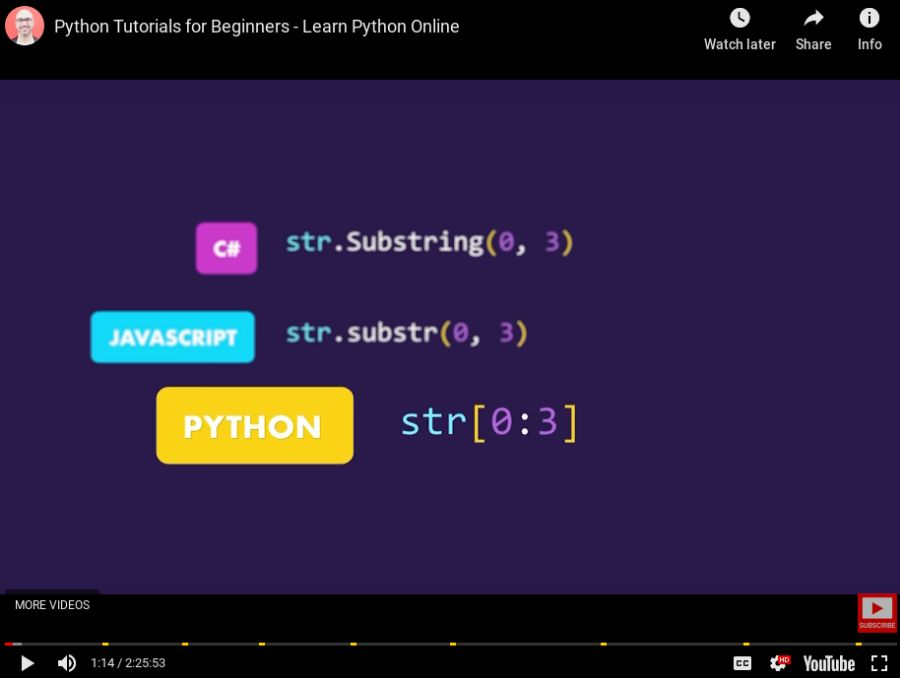
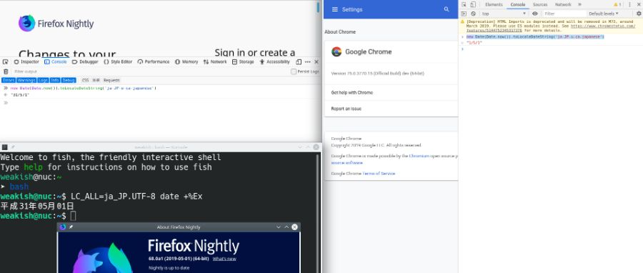

Hello ZeroMe! (Hmm, I can follow myself!)

-- 2016-08-13


[SetupList](http://127.0.0.1:43110/1Mbwaw4Uxp1sq5GzWo3SCmYFTk7mgSWNmw) is online! (SetupList is a 0List clone for sharing software/hardware you are using.)

-- 2016-08-18


20191123: instructions updated for recent zeronet versions

If zeronet's file server port is closed on your machine, you can use an ssh tunnel to accelerate publishing your zites:

```sh
ssh -n -N -R 15441:127.0.0.1:15441 root@REMOTE_IP
```

Replace `15441` with the real file server port and fill the `REMOTE_IP` in the file server external ip of [ZeroNet Config](/Config).

Note you need to enable `AllowTcpForwarding` and `GatewayPorts` of sshd service on the remote machine beforehand.

```sh
sudo sh -c 'echo AllowTcpForwarding yes' >> /etc/ssh/sshd_config
sudo sh -c 'echo GatewayPorts yes' >> /etc/ssh/sshd_config
sudo service sshd restart  # On some OSes, replace `sshd` with `ssh`.
```
 

-- 2016-08-18


Zite (ZeroSite) publish procedure:

1. publish your site (better with 15441 open)
2. browser your site via [ZeroNet proxy](https://bit.no.com:43110/) to make sure everything is O.K.
3. publish your site on [0list](http://127.0.0.1:43110/0list.bit), [Zero Central](http://127.0.0.1:43110/1Dt7FR5aNLkqAjmosWh8cMWzJu633GYN6u) and [New 0Net Sites](http://127.0.0.1:43110/1LtvsjbtQ2tY7SCtCZzC4KhErqEK3bXD4n).

-- 2016-08-18


## How to backup your favorite sites

tl;tr Favorite sites are stored in LocalStorage only. Switching browser or clearing browser data will reset all favorite sites.

0. You are browsing a ZeroNet site.
1. Open "Web Developer Tool" (or something similar) > Application > Storage > LocalStorage > http://127.0.0.1:43110
2. Find the key starting with `site.1HeLLo4uzjaLetFx6NH3PMwFP3qbRbTf3D`
3. Copy its value `{"sites_orderby":"peers","favorite_sites":{"1MeFqFfFFGQfa1J3gJyYYUvb5Lksczq7nH":true,...}}`
4. Save its value to a safe place (a txt file on computer, a mail to yourself, etc)

Restore: Right-click the value `Edit "value"` and replace with your backup.


-- 2016-08-20


Considering a variant of [semver](http://semver.org) major.nth_feature_introduced.YYMM

-- 2016-08-20


TeXmacs is still unstable. Make sure auto save is turned on.

-- 2016-08-25


Google Buzz, Google Wave, Google Reader, Google Code. Now Google Chrome App (by 2018, except on ChromeOS).

-- 2016-08-27


Today I was bitten by `Refused to execute script from ... because its MIME type (text/plain) is not executable, and strict MIME type checking is enabled` when hot-linking a js file hosted on GitHub.

Then I found out that `raw.github.com` is not truely raw access to file asset,
but a view rendered by Rails.
So accessing `raw.github.com` is much heavier than needed.
I don't know why `raw.github.com` is implemented as a Rails view.
Instead of fix this route issue, GitHub added a `X-Content-Type-Options: nosniff` header.

It sounds like a hot fix to me:

- **A:** Let's just make raw a Rails view, so it is simple to write routing code.
- **B:** But this hurts performance.
- **A:** No, programming time is more valuable than processing time. If more human beings view the raw, let's just convince VCs to invest more money for more machines since we are so successful that we have some many views.
- **B:** But there are sites use GitHub to host scripts.
- **A:** No, they should not do this because Rails view is heavy. Let's block them by adding an HTTP header. It's simple.
 

Workaround:

- Put the script to `user.github.io/repo`
- Use a third party CDN like rawgit.com.

-- 2016-08-27


List of all known ZeroMe hubs: https://weakish.github.io/ZeroMeHubList/

-- 2016-08-27


Duokan (ebook app) exports highlights and notes to Evernote **without page numbers**.

-- 2016-08-29


I think hg may fit ipfs more well than git. Like git's dumb http, hg supports [static http](https://www.mercurial-scm.org/wiki/StaticHTTP). Unlike git's changing-all-the-time packfile, hg's revlog is predictable. So hosting hg repos on ipfs is simpler (no need to unpack objects manually), and saves bandwidth (git repos with unpacked objects is usually larger than hg). 

-- 2016-08-29


"IPFS is the Distributed Web ... aims to replace HTTP". WTF! A web of GET and PUT only HTTP? And FS is not file system but web?

-- 2016-08-29


The web flame: pretend that you cannot find exciting, new, modern technologies outside web.

-- 2016-08-29


Cloned site private key recovery:

If `This is my site` in site menu does not works, you can try manually recover cloned site private key (they are generated from your master key in BIP32).

**Warning**: untested

- Make sure you are seeding your LostSite.
- Stop Zeronet.
- Get LostSite `address_index` in `data/LostSiteID/content.json`.
- Get your master key `master_seed` in `data/users.json`.
- Edit `Actions.main(self)` in `src/main.py`,  see below.
- Now start Zeronet, you will see site private key in output. Record it.
- Stop Zeronet. Delete recovery code added above.
- Edit `data/users.json`,  fill the record value (quoted) in `privatekey` at LostSiteID.
- Edit `data/sites.json`, set `own` in LostSiteID to `true`.
- Start Zeronet. Now you should be able to edit/publish your site.

Added code in `src/main.py`:

```python
class Actions(object):
     # code omitted
     def main(self):
          # code omitted
          # Add code below.
          logging.info("--------------------DEBUG: Recovery Begin--------------------")
          from Crypt import CryptBitcoin
          logging.info(CryptBitcoin.hdPrivatekey("YOUR_master_seed", YOUR_address_index))
          logging.info("------------------- DEBUG: Recovery End--------------------")
          # Added code ended here.
          
          logging.info("Starting servers....")
          # code omitted
```

-- 2016-08-30


Just add a 0BSD style license on my profile page: Permission to use, copy, modify, and/or distribute all my posts and comments at ZeroMe for any purpose with or without fee is hereby granted.

-- 2016-08-30


[An example of ZeroSite of photos](http://127.0.0.1:43110/ZAlex.bit/photos/index.html)

-- 2016-08-31


Wish every programming language website has [a gentle introduction like  Ceylon](http://ceylon-lang.org/documentation/1.2/introduction/), demostrating both basic usage and advanced features, but not lengthy. 

-- 2016-09-01


I used to confuse coding style with formatting style. Formatting style like `using n spaces to indent` and `closing brace on its own line` are unlikely to affect readability of code, and they can be auto adjusted via IDE or command line tools. What really matter is coding style, like `if (a=0)` and `++i`. PEP 8 for Python talks a lot about formatting style. This is a cost of Python's layout based (indentation sensitive) syntax: possibly cleaner for small pieces of code, while hard or impossible to be auto formatted by tools like IDEs (crucial for a large code base).

-- 2016-09-03


`i++` should be a pure side effect, a.k.a. `void`, just like `b = c` should be `void` (invalidating `if (a = 0)`).

-- 2016-09-04


IDEs for static typed languages are so powerful, particularly for refactoring. The dark side is making me less acclimatized to dynamic typed languages IDEs, e.g. even PyCharm and RubyMine cannot match IntelliJ or Eclipse.

-- 2016-09-07


In Python, whitespace (space or tab) can be used: (use dot to indicate whitespace)

to **indedent** code (removing will cause error)

```python
def id(x):
....return x
```

and **align** code (can be safely removed)

```python
x.............= 1
long_variable = 2
```

Thus I think it is a good idea to distinguish them with different characters: use `tab` for **indentation**, and `space` for **alignment**.

PEP 8 has a different opinion:

- Use `space` for indentation.
- Keep code unaligned.

-- 2016-09-09


Relieased that I have forgotten what does Hallelujah mean. To me it means some beautiful nonsense in music.

-- 2016-09-11


`camelCaseAreHardToReadIfThereAreMoreThanThreeWords`

`under_line_is_much_easier_to_read`

Exceptions:

- `TypeName` since `TypeNamesWithMoreThanThreeWords` should be avoided.
- `FooBar fooBar` so wherever we see `fooBar`, we know it is of type `FooBar`.


-- 2016-09-12


There are currently 18 ZeroMe hubs (excluding empty hubs with no registered user). And I am seeding 5.  via [zerome-crawler](https://weakish.github.io/zerome-crawler/)

-- 2016-09-16


An ugly workaround of TypeScript's structural typing:

```typescript
type Kind1P = "1p";
type Kind2P = "2p";
type KindHUStrNum = "string | number";

function f(x: number) {
    return x;
}
function g(x: number, y: number) {
    return x + y;
}

let no_f: (x: number, y: number, kind: Kind2P) => number;
function wrap_g(x: number, y: number, kind: KInd2P = "2p") {
    return g(x, y);
}
no_f = wrap_g;

function higher(
        f: (x: string | number, kind: K1P, kindH: KUStrNum) => string,
        y: string | number
        ) {
	console.log(`calling ${f}`);
	return f(y);
}

function sub(x: number): string {
	return `${x * x}`;
}
// higher will not accept `sub`!
```

-- 2016-09-17


All my todos are on wunderlist, which is down now. And I can hardly remember what to do. If wunderlist is implemented as a ZeroSite ...

-- 2016-09-21


[Snapshots of all current, non empty, functional ZeroMe hubs](https://github.com/weakish/0me-hubs-snapshots), 
powered by [0net-snapshot](https://github.com/weakish/0net-snapshot).

-- 2016-09-22


`A then B else C` in Ceylon feels confusing to me.

`A then B else C` looks like `A ? B : C` in other languages, but they are **not the same**:

1. `A then B else C` is actually `(A then B) else C`:

         * `A then B` evaluates to `B` if `A` is not `null`, otherwise evaluates to `null`.
         * `X else Y` evaluates to `X` if `X` is not `null`, otherwise evaluates to `Y`.

2. Thus the type of `B` is `T given T satisfies Object`, i.e. requires to not be `null`.

I think `if (A) then B else C` is much cleaner.

-- 2016-09-25


Found an old macro (in a lisp like language) I wrote a year ago. Now I have difficulties to understand it.

-- 2016-09-29


GitHub helps spreading Git. But there is no balanced competitor currently. This is anti-decentred for a DVCS.

-- 2016-09-30


Finally iPhones get water resistent.

-- 2016-10-02


Visual Studio Code: "Code editing. Redefined." How a code editor borrowed a lot from SublimeText and TextMate dare to declare this?

-- 2016-10-03


vscode is open source (MIT) and Visual Studio Code is proprietary. So confusing the names!

-- 2016-10-06


Thought there was something wrong with the sound configuration on my machine. Then I found out the mp3 I was playing is 32kbps.

-- 2016-10-07


September 2015 Evernote Food shutdown. dianping.com (restaurant review site in China) also shutdown its public API service (individual developers cannot apply API access, APIs are only available to a few parterners) on that month.

-- 2016-10-08


 Windows Mobile does not support two factor auth, you have to use an app password. Now app password does not work on my phone (used to work on previous versions of Windows Mobile 10). I have to turn off two factor auth. Not too old Android versions support two factor auth out of the box.

-- 2016-10-10


Programming languages are clearer than natural languages. So "well-commented code" may not be well-written.

To reduce commenting:

- Use meaningful function and variable/value name.
- Declare local variable near its usage.
- Avoid deep nested function call expression. Extract meaningful immediate value declaration.

Here 'commenting' mainly refers to inline comments,
i.e. comments explaining implementation details.
Doc annotation of public modules and functions on their usage is fine.

-- 2016-10-13


I prefer explicit else branch over fall through flow.

For example:

```ceylon
Boolean if_else(Integer x) {
    if (x > 0) {
        if (x < 10) {
            return false;
        }
    } else if (x < -10) {
        return false;
    }
    return true;
}
```

It is short, but difficult to figure out the control flow.

Rewrite it more explicitly, without omitting else branch:

```ceylon
Boolean if_else(Integer x) {
    if (x > 0) {
        // This is for demonstration only.
        // `if (x > 0, x < 10)` is clearer.
        // Pretend there were more complex branching here.
        if (x < 10) {
            return false;
        } else {
            return true;
        }
    } else if (x < -10) {
        return false;
    } else {
        return true;
    }
}
```

Also, avoid using `variable` to save else branch.

For example:

```ceylon
variable Integer x = 0;
if (condition) {
    x = 1;
}
```

can be rewritten to

```ceylon
Integer x;
if (condition) {
    x = 1;
} else {
    x = 0;
}
```

-- 2016-10-18


In Ceylon, cases in `switch` need to be both disjoint and exhausted. Using a strict form helps to reduce bugs.

For example, suppose we have the following code:

```ceylon
Path path = current;
if (is Directory path) { // typo, should be `path.resource`.
    // ...
} else { // dead code
    // ...
}
```

There is a typo in the above code, `path` should be `path.resource`.
So the above code will never go into the else branch,
since a Path is always not a Directory.

However, if we use switch with explicit cases:

```ceylon
switch (path)
case (is Directory) {
    // ...
}
case (is File|Link|Nil) {
    // ...
}
```

The compiler will refuse to compile, saying cases are not exhausted.

-- 2016-10-21


citibank's "change password" gives misleading error info ("must contain at least 1 digit and 1 letter") if new password contains some special characters like `@`.

-- 2016-10-23


The main audience of code is human beings, not tests. Improving testability should not harm readability.

-- 2016-10-25


WTF! New generation of MacBook Pro!

It's Pro so it does not need to be so thin that it uses  a painful to type keyboard as on MacBook. Unified type-C is too cool to connect other devices. Even Apple self's devices are not unified, so you cannot charge iPhones without an adapter. Also replacing MagSafe with type-C is obivously a regression. And the 13" version only has two slots! Also the price is much expensive than older genrations. 

In fact, Apple now effectly does not sell laptops. MacBook and MacBook Air only has 4 or 8GB unupgradable RAM. Now they ruied MacBook Pro, the only series of sufficient RAM.

-- 2016-10-28


mp3.163.com (a music distribution site in China) does not have any API. In fact it even encryptes post params with some home made algorithm (the algorithm is different on different clients and is evolving, the current API in web UI is based on AES, RSA and MD5) on HTTP (it does not support HTTPS). That's why I have never registered an account on it. 

-- 2016-10-29


The email to onfirm email address on dida365.com (Chinese version of TickTick) does not show any explicit url link. The link it is hide in HTML. It is wrong to assume every email client renders HTML correctly.

-- 2016-10-31


Although Python still does not understand type hints, at least IDEs will give a warning. Or you can check types via `mypy`.

-- 2016-11-02


All Linux distributions where UEFI Secure Boot works out of the box (e.g. Fedora, OpenSuse, Ubuntu) are using systemd! #WTF

-- 2016-11-03


For any one want to pick up programming language , I recommend [The Little Schemer](https://www.amazon.com/Little-Schemer-Daniel-P-Friedman/dp/0262560992)，less than 200 pages and can be finished in a weekend. It starts from zero and gradually introduces concepts like recursion, higher-order functions, curry, Church encoding, halting problem, lambda calculus,  fixed point, Y combinator, continuation, CPS, Godel Incompleteness Theorem, and a basic interperator for a simplified progarmming language. 

If you think The Little Schemer is expensive, you can try [CoffeeScript Ristretto](https://leanpub.com/coffeescript-ristretto), somehow a translation of The Little Schemer to CoffeeScript, which can be read on line for free. 

Do not worry the above books do not use a language you are going to use in your work. After all, the right approach to pick the certain programming language you are going to use is to focus on  semantics, instead of syntax; focus on concepts, instead of concrete details; focus on good parts, instead of all parts; also learning the implemantation of the language is a good way, since modeling is an effective way of learning (no need a full implement, also not worry about performance, just implement basic and import concepts).  The Littele Schemer fully conforms to this approach. Once you learned the scheme language with it, you know how to learn a new languge, and you know essential concepts of programing language. Then you can just pick up any language you are going to use in the same way. And because you only need to understand new semantics and concepts of the new language, it will be fast. For syntax, just use a good IDE or setup your editor properly.


-- 2016-11-03


A quick review of germ.io:

What is cool:

- Distinguish ideation with action.
- Distinguish completed with not taken.
- Nested sub list.
- In action view, tasks(germs) with sub-tasks actionable are marked with a lock icon.

Missing:

- No export data.
- No mobile client.
- Status (Ideation, action, etc) is unclikable on overview.
- Note markup is Rich text, no option for markdown.
- No markup for code block.
- When change status from ideation to action, assign to no one by default, should assign to the one change status by default.
- No way to hide completed and not taken tasks.


-- 2016-11-04


Use registery to swap keys under Windows.

For example, use Caps Lock key as an addtional Escape key.

```reg
Windows Registry Editor Version 5.00

[HKEY_LOCAL_MACHINE\SYSTEM\CurrentControlSet\Control\Keyboard Layout]
"Scancode Map"=hex:00,00,00,00,00,00,00,00,02,00,00,00,01,00,3a,00,00,00,00,00
```

Notes:

- `00,00,00,00,00,00,00,00`: header.
- `02`: data length (`n + 1` where `n` is numer of mapped keys).
- `00,00,00`: end of data length.
- `01,00`: Esc.
- `3a,00`: Caps.
- `00,00,00,00,00`: end.

-- 2016-11-13


Windows 8.1's Microsoft Pinyin input method:

1. cannot change double pinyin schema
2. no keyboard shortcut to switch between traditional Chinese and simplified Chinese
3. no option to set default to English

-- 2016-11-14


After repositioning Windows 8.1's task bar to left, right, or top, hovering cursor to bottom left corner still reveals the windows start icon.

-- 2016-11-15


JavaScript's ASI (auto semicolon insertion) is confusing. However, if I prefer to not omit semicolons, I only need to remember one rule: not  breaking line after `throw`. (There are other rules, but I am unlikely to write code related to other rules, e.g. `i\n++\nb`.)

On the other side,  if I prefer to omit semicolons, I need to remember additional rules:

- `(`
- `[`
- `.`
- `,`
- `+`, `-`, `*`, `/`
- `for` and `while`

Thus my choice is not omitting semicolons.

-- 2016-11-16


Quora hides posts/answers to force you to register/login. Now its Chinese clone Zhihu finally borrows this "feature".

-- 2016-11-17


TypeScript 2.0 brings in more fix of the poorly designed type system:

```sh
tsc --strictNullChecks --noImplicitThis --noUnusedParameters --noUnusedLocals
```

-- 2016-11-20


[Watch Trump's Pick to Run the CIA Call Edward Snowden a 'Traitor' Who Should Be 'Given a Death Sentence'](https://reason.com/blog/2016/11/18/watch-trumps-reported-pick-to-run-the-ci).

I said before the election result came out that Trump is evil. "Make America great again!" This sounds like what Beijing announced  in 2012: "The Chinese Dream is the great rejuvenation of the Chinese nation."

Bradley Manning is aleray in prison. Assange hides in Ecuadorian Embassy, and Snowden has been kept in Russia for 3 years.
Make America great again so the great U.S. government could brought back Assange and Snowden and given them due process?

I bet the greatest archivement of Trump would be what he had done before elected as U.S. President: stopping Hillary.

-- 2016-11-22


Flaws of TypeScript's type system:

- functions with fewer parameters are assignable to functions that take more parameters,
- non-void functions are assignable to void functions,
- all types are assignable to empty interfaces, and
- TypeScript cannot infer expected type with unused parameter in generics.


-- 2016-11-23


Overloading an operator should be consistent to all types supporting the operator.

-- 2016-11-24


Kotlin uses `Array<T>` for `vararg p: T` (variadic functions) underhood, but:

- Basic types are special, e.g. `IntArray` for `vararg p: Int`.
- `p: Array<T>` and `vararg p: T` behaves differently. In other words, given a function `Array<T> -> Unit`, we do not know how to invoke it just from its signature. (`Array<T> -> Unit` may be an infix function, but all infix functions can be invoked as normal functions.)

-- 2016-11-25


Black Friday sales for VPS: https://www.lowendtalk.com/categories/offers

-- 2016-11-26


Tunanota and ProtonMail looks promising, but they do not work with others, i.e. Tunanota users cannot exchange encrypted mails with ProtonMail users. Also, Tunanota and ProtonMail do not work with GPG users. Encryption is important, but openness is also important. And GPG is a good example of implementating encryption without reducing openness.

An conterexample is Scryptmail, which supports import and export of GPG keys.

-- 2016-11-27


[$20 credit for new users of Vultr](http://www.vultr.com/?ref=7046521-3B) (KVM VPS with SSD, billed hourly/monthly, located in US, EU, Austrilia, Singapore, and Japan). 

Vultr v.s. DigitalOcean: They are quite similar except that Vultr has slightly more RAM for $5/m plan, and Vultr's snapshots are still free right now.

-- 2016-11-29


Firefox version 41 to 50 (including 45 ESR used by the latest version of the Tor browser) has a memory corruption vulnerability allows malicious code to be executed on Windows, thus deanonymize Tor users.

To protect yourself from similar possible future vulnerabilities:

1. the ultimate 2 physical machine solution: use two physical machine A and B. A has only one lan card to connect to B (make sure A does not have a wireless card, or has a physical switch to turn off wireless card).  B has 2 lan card, one for A, one for Internet. Running the browser on A and Tor on B,  and the connection between A and B is configured as NAT only. So A can only connect to Internet via Tor, and possible vulnerability in browser can only leak IP/MAC etc of A, not B. For max security, do not buy A online, incase the online seller may record A's hardware information together with your identity/address.

2. the 2 virtual machine solution: similarly to the solution above, but use two Virtual machine instead. This does not protect you from virtual emualtor's escape vul­nerabilities though. However, virtual emualtor's escape vulnerabilities are rare (and your machine need to encounter both virtual emualtor's escape vulnerability and browser's vulnerability at the same time to leak the information of physical machine).

3. Less secure than the above solutions, but the easiest: Use Tor Browser with JavaScript off, or at least block JavaScript by default, and whitelist sites you trusted.

-- 2016-11-30


ZeroNet's answer to CDN/cloud hosting industry: kill it. I think this is one of the most charming part of technology: rather than sloving a problem, make the problem irrelevant.

-- 2016-12-01


Brace formatting style

I used to prefer Java style (braces on the same line) over Allman style (braces on their own line). I use large fonts on a small screen, thus a condensed style is preferred.

However, I recently found out that although Java style is clean for simple code, it does not work well with long parameter/conditional list. For example:

```c
if (starts_with(path, home, path_size, home_path_size) ||
    check_with(path, home, path_size, home_path_size) {
    recreate(path, home);
    return home_path_size;
} else {
    return 0;
}
```

The simple statement `return 0` in else branch is clear.
But I cannot tell whether `recreate(path, home)` belongs to the conditional list or the function body at a glance.

On the other side, I can get the whole structure at a glance with Allman style:

```c
if (starts_with(path, home, path_size, home_path_size) ||
    check_with(path, home, path_size, home_path_size)
{
    recreate(path, home);
    return home_path_size;
}
else
{
    return 0;
}
```

Also, since I use large fonts on small screen,
I can not read `if (long || next_line ) {` at once.
So the Java style requires me to move my eyes to right, then move my eyes back to next line, which is slow.
With Allman style, to get an overview of structure,
I only need to focus on the left half of the code block, and no eye movements are needed. This makes up the wasted lines.

I guess for large screens a few wasted lines is affordable for clarity.

Maybe the Java style is suitable for a setup with small fonts on a small screen, provided the syntax highlight scheme distinguishes braces clearly?

-- 2016-12-02


[911 The new pearl harbor](https://www.youtube.com/watch?v=8DOnAn_PX6M) Politicians do not have imagination is totally a stereotype!

-- 2016-12-03


mypy is still incomplete.

-- 2016-12-05


ZeroMail does not hide sender (and effectively timestamp and conversations may reveal receipt).

Similarly, MaidSafe Email does not hide receipt.

-- 2016-12-06


@zeronetuseri6293 asked how to explain Systemd is bad "like I am five". I just prepare some text to brainwash five-year-old "Systemd is bad":

You are five. You do not know how to cook pasta, how to bake bread, and how to clean the window, etc. Fortunately there are a lot of volunteers to help you to do all these things.

The problem is these volunteers tend to commit suicide because of intrinsic depression. (They think helping a five year old may helps to reduce depression.)  And you are lazy and shy. You do not want to manage them yourself. There is a magician called Sysfive. When you go to sleep, Sysfive will kill those volunteers (not let them go home to avoid  traffic jam), and when you awake, Sysfive will reborn those volunteers. Also if you find some volunteer killed themselves, you can ask Sysfive to reborn them.

These volunteers speak a language named Gnome. You happen to speak this language, too. And all those volunteers are from the same nation Debian. Debian is located at a continent called Linux. The continent Linux is located at a planet called unix.

Your friends have volunteers speaking different languages like KDE and Xfce, from different places like OpenSUSE (also on Linux continent) and FreeBSD (on the BSD continent), and different magicians like OpenRC and RunIt (one magician can work for a lot of children.) You talked with your friends, and found out that you can find volunteers speaking Gnome from any nation and continent. Also, although volunteers from some certain countries only have experience with some magicians, all magicians can reborn volunteers from any country with some effort. "This is good. Maybe one day I will ask FreeBSD volunteers to help me. One of my friends said FreeBSD volunteers are cool." You thought. "And maybe one day I can ask RunIt the master to reborn volunteers for me. I heard that Sysfive the master is too old."

Until one day, you learned that Systemd the master can only reborn volunteers from the Linux continent. Systemd refuses to reborn any volunteer from other continents such as BSD and Solaris.

Also you learned that soon volunteers speaking Gnome can only be reborn by Systemd. They refuse to be reborn by other magicians.

Also, there used to be different volunteers to do different things, for example, one helps you to do accounting (e.g. how much ham you have eaten, eating ham is bad for your health), and one configures your smart phone (smart phones are too smart to configure for a five year old). But
Systemd said: "I am very very powerful. I will do all these things. Send those volunteers away."

You as a five year old may not think Systemd is bad.
But I hope you understand why some people consider Systemd as "bad".


-- 2016-12-07


C is a hacky language. For example, string in C. If you think string in C is an array of characters, then you cannot put some characters in string (such as Unicode character) and you can put some noncharacters into string. If you think string is an an array of bytes, like a buffer, then you cannot put the byte `\0` into string. So string in C is inconsistent viewed from both high level and low level.

Go, advertised as modern C, inherits C's hacky mindset:

- Error handling. Go uses multiple return values to represent union type `Result | SomeError` or optional type `Result | Null`: returning either `{result, nil}` or `{nil, error}`. The ordering of `result` and `error`, and one and only one of them must be `nil` is just a convention followed by programmers, not enforced by type system.

- For variable declaration without initialization, instead of checking it is correctly initialized later, Go just implicitly initialize it with a zero value. Even worse, Go uses `nil` as zero value for pointers, slices, interfaces, maps, channels, and functions.
 

-- 2016-12-08


Go back to use paper to manage my todos. (Some todos are still in WunderList, e.g. shopping list, cause I do not want to bring paper and pencil to supermarkets.)

-- 2016-12-09


When the function parameter is a function pointer, CLion (2016.3) cannot auto complete function name as parameter, like IntelliJ Idea for Java.

-- 2016-12-10


Lesson learned: when your `data.json` local copy is outdated (e.g. rollback to an old version manually because of file system issue), do not post new content to the zite that outdated `data.json` belongs to. Otherwise you will publish your "deletions".

-- 2016-12-11


Visual Studio Code only provides 32 bit downloads for Windows.

-- 2016-12-12


Yandex mail smtp refuses to send a GPG encrypted mail saying it looks like spam...

-- 2016-12-14


[SetupList](/setuplist.0web.bit/) now has its .bit domain [setuplist.0web.bit](/setuplist.0web.bit/).

P.S. If you want to register a .bit domain, but do not want to setup a full namecoin node on your machine, you may get a .bit domain for your zeronet site at [0web.bit](/0web.bit/) for 0.001BTC/0.1XMR.

-- 2016-12-15


Currently FaceBook Message and Google Allo has optional end to end encryption. And WhatsApp has end to end encryption enabled for all messages. On the other hand, WeChat still uses http.  #ThisIsChina

-- 2016-12-16


Just launched [0git.bit](/0git.bit), a list of git repositories on ZeroNet.

I wrote it based on [the ZeroChat tutorial on ZeroBlog](/Blog.ZeroNetwork.bit/). 

Features:

- Also supports Kaffie ID.
- Responsive card based layout.
- Minimal design.
- Under 200 lines of code.
- Licensed under 0BSD.

Its source code is hosted at ZeroNet, [browsable and cloneable](/0git.0git.bit).

P.S. editing posts is not implemented yet.


-- 2016-12-18


Problems of StorJ:

- Semi-central: storage is distributed, but the abstract object layer and payment is central.
- For every dollar a renter paid to StorJ, the host finally get 60 cents, StorJ keeps 40 cents.

-- 2016-12-19


Problems of Sia:

1. It supports proof of storage but not proof of bandwidth.
2. The Sia developers mined the first 100 blocks of Sia.
3. 3.9% of all successful storage contract payouts go to Siafund, of which 87.5% is owned by Sia's parent company.

-- 2016-12-20


[Beaker](https://beakerbrowser.com/) is similar to ZeroNet. Their difference:

- Beaker does not host visited sites.  (You can enable it manually.)
- Beaker sites support versioning.
- Beaker API is much simpler than ZeroNet, no select user (id), no optional file, no encryption, etc. So dynamic sites are easier to create via ZeroNet.
- ZeroNet uses namecoin `.bit`. Beaker uses regular domain names (via `TXT` record. It's experimental, not man-in-the-middle attack proof ).

Also, because Beaker requires  a customized browser:

- it uses `dat://` schema.
- Beaker sites need to ask user permission to access clearnet.

(These are not substantial differences since anyone can make a customized browser for Zeronet.)

Other differences are technical details, like ZeroNet is written in Python, while Beaker is written in JavaScript, and ZeroNet uses base58 encoded site address (compatible with bitcoin), while Beaker uses hex encoded address.

-- 2016-12-21


PyCharm 2016.3 claims to support Python 3.6's f-strings (formatted literal). But in fact it just supports syntax highlight. All PyCharm's intelligent features are not enabled for code embedded in f-strings.

-- 2016-12-22


Opened software manager in OpenSUSE and found in "rpm groups" there are `application` and `applications`, `developement` and `development`.

-- 2016-12-23


Just fried some peanuts, which increased the PM 2.5 by 8 ug/m^3 in kitchen. So frying will not be a source of local air pollution  if you have extractor hood opened and keep the oil temperature low. 

-- 2016-12-24


The confusing^W smarty Kotlin

What would be the type of `f` in the following line?

```kotlin
val s: Int = f(1, 2, 3)
```

Not considering subtyping and generic,
the type f may be one of:

1. `(Int, Int, Int) -> Int`, the most  intuitive one
2. `(IntArray) -> Int`, a variadic function
3. `f`, an object named `f` with an `invoke` method

-- 2016-12-27


USB 3 external disks are 10-20% slower on VirtualBox.

-- 2016-12-28


Apache Portable Runtime is originally supporting library for Apache web server. Thus it uses memory pool heavily. So it may not be suitable to use APR as a standard library for general C programming.

-- 2016-12-31


Just found some old notes on K&R C book.

The ink (I used a cheap ballpoint pen) is fading but still readable with some efforts.  Most notes are tricky parts of C, which are somehow irrelevant now (either being familiar with them or found out I rarely use them). Some notes I cannot agree now, e.g. "Union really looks like a dirty hack on struct."  on p. 125. However, on p.89, there is a note on `while (*s++ = *t++)` saying "Take me minutes to understand." Currently it would still take me minutes to understand it. Proud of it.^W^W^W

-- 2017-01-01


Yoda expressions are useful for tests in C, such as in `assert(true == ...` and `assert(false == ...`.

-- 2017-01-02


Miss `finally` or `defer` in C.

-- 2017-01-03


If you run ZeroNet on a remote machine, the doc recommends enabling `UiPassword`. But if your are using an unsafe network (public wifi, evil ISP, etc), password is transferred over insecure HTTP protocol. So for safety, you need to configure a reverse proxy with SSL for ZeroNet.

Alternatively, you can just start ZeroNet on remote machine as normal,
without `--ui_ip`, `UiPassword`, reverse proxy, SSL, etc.
And run this command at local machine:

    ssh -L 43110:127.0.0.1:43110 -N username@remote

Then you can just access `http://127.0.0.1:43110/` on your local machine, securely.


-- 2017-01-04


new History().repeat

There is no first class functions in Java, so to pass functions, we wrap functions in classes. Now there is no first class function types in TypedRacket, so [to predicate function types, we wrap functions in structs](https://stackoverflow.com/a/27866496).  

P.S. Same applies to TypeScript, Flow, Kotlin, and Swift. Ceylon's function type is first class, though.

-- 2017-01-05


"A Little Java, A Few Patterns" uses a special coding style to remark mutability:

Put semicolon on its own line.

For example:

```java
x = x + 1
; // Future references to `x` after this line reflect the change.
anArray.append(1)
; // Same as above.
```

-- 2017-01-06


vscode's refactoring is still much less powerful than WebStorm, even for TypeScript.

-- 2017-01-07


Install ZeroNet as an auto-start service on FreeBSD:

```sh
pkg install zeronet
sysrc zeronet_enable="YES"
service zeronet start
```

Run ZeroNet command:

```sh
su -m nobody zeronet siteCreate
```

-- 2017-01-08


> the ideas enshrined in the Ubuntu Manifesto: 
> that software should be available free of charge,
> that software tools should be usable by people in their local language
> and despite any disabilities, 
> and that people should have the freedom to customize and alter their software
> in whatever way they see fit.

This is what Ubuntu put on its front page about 10 years ago.

Nowadays these words are missing from the entire site of ubuntu.com
(the only place left is the handbook of LTS, maybe no one bothered to update the preface of the handbook?)

And this is what now on the front page of ubuntu.com:

> Ubuntu is an open source software platform that runs from the cloud, to the smartphone, to all your things.

Mark Shuttleworth used to think "the next big thing" is "build a platform so people can share free (as in freedom) things such as software, music, etc".

Later "the next big thing" of Ubuntu gradually changed to "universal user experience on all devices", which is less uncertain since Apple has already been a successful example.
(Apple is determined to make Mac OS X more and more like iOS, and make Apple laptops more and more like iPads.)

Not know how well Ubuntu will do in next 10 years.
Anywhere, "universal user experience" has nothing to do with the  original Nguni Bantu word "Ubuntu".


-- 2017-01-09


Sign and publish your posts/comments from command line:

```sh
zeronet.py siteSign site-address-of-other-people --inner_path data/users/address-of-myself/content.json --publish
```

It will asks the private key,
unless you happen to be the site owner,
fill in your cert's auth key.

For example, if you are signed in with `you@zeroid.bit`, then you can find `certs`->`zeroid.bit`->`auth_privatekey` in `data/users.json`.

Thanks to @nofish for this tip.

-- 2017-01-10


The so called whatsapp 'backdoor' was documented in the [blog post of Open Whisper Systems on 05 Apr 2016](https://whispersystems.org/blog/whatsapp-complete/).

I think the notification on security code for a contact changing should be "opt out" instead of "opt in". I guess Facebook made this "opt in" so users having no idea of public key encryption will not get confused by the security code change notification. They could make it "opt out" with a detailed explanation on first notification of security code change instead, in my own opinion.

I would rather call it a less secure design choice. Anyway, no matter you think it is a backdoor or not, it is not news.

-- 2017-01-16


A programmer's client (a local cinema) website got hacked, with racist messages posted. The policy suspected the programmer hacked the site, and got a warrant to seize the programmer's computer. Then they sent **21 armed polices**, 3 of them to seize the computer, and **18 of them as witness**.

On early morning, these polices **broke in** the programmer's home, and **shot dead** the programmer when he is talking to his lawyer on the phone (**4 shots on chest and face**).
And the **18 witness polices** witnessed that the programmer fired a crossbow bolt at one of them (that police was protected by Kevlar thus slightly injured).

This is *not* something happening in a magic realism novel or an absurdist  movie. This is what happened on **December 23rd 2016**, **London, Ontario, Canada**.

The programmer is **Sam Maloney**, the creator of [morphis](https://morph.is/) (a free open source p2p distributed datastore), a husband and a father of two children.

News reports:

1. [first news report on nationalpost.com](http://news.nationalpost.com/news/canada/lawyer-tells-client-on-phone-during-predawn-raid-theyre-going-to-shoot-you-sam-put-your-hands-up)
2. [more recent report on Motherboard](https://motherboard.vice.com/read/why-did-police-kill-an-alleged-small-time-hacker-canada-sam-maloney) ([ZeroNet mirror](http://127.0.0.1:43110/1uEc35aRpkDgVmJ35jcMEHm4D2JCcEejp/motherboard/))


-- 2017-01-18


cdrtools author's viewpoint on [controversy of cdrtools license compatibility](http://cdrtools.sourceforge.net/private/linux-dist.html).

-- 2017-01-22


Encountered ads with only one sentence "Only bricks produced by The Lego Group are Lego ® bricks." and one Lego logo. This is advertising of silliness. No sense and no design.

-- 2017-01-24


  Used openSUSE Leap 42.2 for a few days. You have to add a few repositories to install things like mp3, flash, and input methods. You have to configure mounting NTFS partitions yourself (via YaST or manually editing `/etc/fstab`). Default fonts setting for Chinese is terrible. Other things work out of the box mostly. KDE Plasma 5.8.2 roughly catches up the polishness of recent versions of Windows.

-- 2017-01-26


Lantern only provides binary package in deb format for Linux. To install lantern on rpm based Linux distributions, first install `rpmbuild`, `alien` (to convert deb to rpm) and `libappindicator3-1` (lantern's dependency), then use `alien` to convert the deb to rpm, and finally install the converted rpm.

-- 2017-01-27


A recent Windows update forced me to re-select options like no personalized ad, ruined my registry key for a customized keyboard layout (dvorak and swap esc & caps), and pined the Mail app on my taskbar. This is more like a regression than an update to me. (To be fair, it does allow me to launch some Windows applications under WSL.) 

-- 2017-08-21


`sh` is the only language I am using that has dynamic scoping for variables. (Privacy leaked: I do not use Emacs.) 

-- 2017-08-25


"Go to definition" does not work for shell scripts in vscode. `*` (from vscodevim extension) can be used as a workaround.

-- 2017-08-25


about.me has not been about me for a long time.

about.me was a simple profile page before 2016.

Now it is supposed to direct bandwidth to the site matters most to the user. about.me called it "personal pages with a purpose". While this feature may be useful, this is not the original about.me anymore. The original purpose of about.me is you can insert a `about.me/you` link in bios of other sites, less to type and easier to update.

-- 2017-08-27


Failed to understand the `fmap` signature in Haskell in about 15 minutes:

```haskell
class Functor f where
    fmap :: (a -> b) -> f a -> f b
```

It took me about 15 minutes to realize that
I have seen too many curried functions
so my brain instantly parses

```haskell
(a -> b) -> f a -> f b
```

as

```swift
((a -> b), f(a)) -> f(b)
```

instead of the intended

```swift
(a -> b) -> (f(a) -> f(b))
```

So I have to:

1. either admit that my brain is blunt
2. or  profess that the currying way of ML/Haskell languages is confusing

As an ignorant person, obviously  I chose 2.


-- 2017-08-27


Finally, concepts such as polymorphism, generics, type variable/parameter, overloading, and type class are united in my brain.

-- 2017-08-28


Powershell aliases still do not support tab completion.

-- 2017-09-01


MIT scheme taught me a chuunibyou way to say goodbye: "Moriturus te saluto."

-- 2017-09-02


To stop EME (Encrypted Media Extension) from entering W3C Standard, FSF asked people to **dial up** Tim Berners-Lee. First, asking people to dial up a person is not protest but **DDOS**. Second, no one cares W3C standard today. If Apple (safari), Google (chrome), Mozilla (firefox) and Microsoft (Edge) were dead-set, then the story is over. Neither W3C nor Tim Berners-Lee can do anything about it. (Fortunately Mozilla is not dead-set on EME, although Firefox Desktop has implemented it years ago.)

-- 2017-09-03


Now mail.google.com redirects to www.google.com/gmail/about/, which has a fancy design. I miss the simple UI with a login form and storage space counter. 

-- 2017-09-04


Baidu Map iOS keeps requesting location on background when location info is not available, draining batteries and heating device very quickly.

-- 2017-09-05


The intuition behind Curry-Howard correspondence: 

1. Staring from propositions (types of parameters),  we construct proof (function) to get other proposition (type of return value).
2. The rule to construct proof (function) is called logic (type system).
3. It is hard to construct a proof (function). But once the proof (function) has been constructed, it is easy to verify the proof is valid (the function does return the value of specified type).

Notes:

1. In practice, the verification of proof is not always easy, because real word proof tends to omit a lot of implicit knowledge and intermediate steps.
2. The verification of returned type of function is so easy that we do not need to verify that manually, the interpreter/compiler will verify that for us automatically.
3. The Curry-Howard correspondence is the basis of theorem prover such as Coq. 

-- 2017-09-08


I think sometimes a ML/Haskell like syntax may be a better alternative for math notation than lisp. Lisp is unambiguous but slightly harder to type manually (I am too lazy to use the lisp IDE/mode and copy-paste, or extend the editor to support auto completion in code blocks.) Compared to C like syntax, ML/Haskell saves some typing of commas and parenthesis.

-- 2017-09-09


Years passed, and Google Contact still does not support exporting contacts. It still redirects me to the "old version" for exporting.

-- 2017-09-09


I found out that I could not understand some code I wrote 8 months ago.

Then I checked the git commit message 8 months ago.
The commit message said

> I hope I implemented the algorithm right.

So this is the fault of the previous version of me myself. If the previous version of me myself truly understood the algorithm, then I would have resumed or reinvented the algorithm quickly now.

-- 2017-09-12


iPhone X shows that machine learning can be done on client side, without talking to a remote server. This is encouraging for privacy concerned services and users.

I am not sure about the long term impact of animoji. Will it make people's  countenance more exaggerated in real life?

iPhone {X, 8, 8P, 7, 7P, 6S, 6SP, SE}. Consumers need to choose one from **eight** models. Not sure if this is good or bad for consumers, but this is definitely not the Apple way.

-- 2017-09-13


I always prefer a small screen mobile device, which is easier to carry. I do not read/browse/view a lot with the mobile phone, since either neck or shoulders are in an unnatural angle.

-- 2017-09-14


Microsoft had suspended my outlook mail account for several weeks , saying my account is used to send a lot of junk mails, or violates their TOS in *unspecified* way.

I totally have no idea what violates their TOS (I had not sent mails using this account, let alone junk mails). To unblock my account, I need a cellphone. I am very upset about the assumption that you have to have a cellphone.

And to get help from Microsoft support for my locked account issue I need to have a working account. This is a deadlock. Thus I decide to stop use Microsoft account.

Then I asked myself what will happen if the same thing happens to my gmail account? Then I realized the fact that I did not bother set up my own domain for emails put me into danger.

-- 2017-09-24


[tutanota client side source code](https://github.com/tutao/tutanota/blob/ea1c1ef1c70c8f3c48dcfaa70f91cd41b7fbdd95/flow/libs.js#L86) contains Flow type definition for Mithril. 

-- 2017-10-01


Recently I started to read a book during wait time when I had taken a bag with me (a thin book is light and there is no more worries for short of battery), or just let my mind fly away when I had not. A win-win strategy for the life of my neck and the life of mobile phone battery.

-- 2017-10-06


Moving one icon on my mobile phone, all icons between the old place and the new place of the moved icon, will shift their places.

I am really upset by this.

Image in an insane programming lanuage, there is a list, say,

```python
l = [a, b, c, d, e, f, g]
```

And when you eval `l[0] = l[6]`, the list becomes:

```python
l = [g, a, b, c, d, e, f]
```

What a big surprise!

In such a programming language, imaging how many statements you have to write to accomplish simple tasks such as swaping `a` and `g`.

On the other side, in any sane programming language, to swap `a` and `g`, you just need to write something like:

```python
tmp = l[0]
l[0] = l[6]
l[6] = tmp
```

That is basically the behavior of desktop shortcuts of old-fashioned desktop operating systems.

I encountered this design fault on iOS devices before.
And now it infects my Android phone.
(Not sure whether Android 8.0 or the mobile phone producer introduced this design fault.)

My workaround: Only put icons most frequently used on the first screen. Put all other icons in folders. And arrange those folders by their names, pretending that they cannot be arranged freely.

-- 2018-02-21


Backing up to USB 3 external hard disk with `borg create -C lz4` is very fast.

-- 2018-02-27


extensiontest.com (test if a chrome extension is compatible with firefox) is not 100% accurate. Just encountered an chrome extension passing extensiontest.com but not usable in Firefox.

-- 2018-03-02


Compared to wine and tea, chocolate is inexpensive. The most expensive chocolate I've eaten is Amedei CRU, which is still affordable.

-- 2018-03-09


Just published my first Firefox extension: [arxiv-url], a Firefox addon to replace arxiv pdf links to corresponding abstract links. 

[arxiv-url]: https://addons.mozilla.org/en-US/firefox/addon/arxiv-url/

Writing a firefox extension is actually easier than I thought. If you'd like to write one yourself, just follow mozilla's [doc].

[doc]: https://developer.mozilla.org/en-US/Add-ons/WebExtensions/Your_first_WebExtension

Note:

1. If you do not want to install `web-ext` (it depends on node and some npm packages) for `web-ext build`, you can just zip your extension.
2. Submit the zip file to  [AMO] directly. No need to `web-ext sign` it (if you did so, the signature will be replaced with AMO after all.)

[AMO]: https://addons.mozilla.org

-- 2018-03-09


Very pessimistic about mobile phones I would have to buy in future:
- Android: With the recent release of Xperia XZ2 Compact (5"), Android phones finally stepped into the no more phones under 5" era.
- GNU/Linux: Librem 5, as its name told, is a 5" phone.
- iOS: Unfortunately it seems the only choice left, Defective by Design.

-- 2018-03-10


One of my favorite poem of Li Ch'ing-chao (李清照) is "As in a Dream" (如夢令）.

Light rain and gusty wind last night. （昨夜雨疏風驟）
Sound sleep did not dispel the slight drunkenness. （濃睡不消殘酒）
I ask the one rolling up the curtain,　（試問卷簾人）
but she answers: "The cherry-apple trees are the same."　（卻道海棠依舊）
"Don't you know? Don't you know? The red should languish while the green should plump."　（知否，知否，應是綠肥紅瘦）

(I am a native speaker of Chinese but not a native speaker of English. I tried my best to translate it. Any feedback on translation is welcome.)

"The red should languish while the green should plump" reveals the tenderness of the poet, while "should" implies the firmness of the poet.

"Don't you know? Don't you know?" That is the reality distortion field of a groggy poet.

-- 2018-03-13


I learnt typing on a typewriter, so membrane keyboards, especially membrane keyboards with short key travel, feel unnatural to me. However, I found out that my fingers are more tired when typing a lot on mechanical keyboards. (Have not tried Topre keyboards.)

-- 2018-03-14


Saw "novel blockchain gameplay" in an elevator ad of a browser game. This reminds me of a time when a lot of products advertise themselves using "novel nano-meter technology". 

-- 2018-03-18


Almost all smart phones today use a non-removable battery. And most smart phones do not use all-day battery. What an insane design combination!

-- 2018-03-26


debian.org is not available in CN (not sure whether it has been blocked by the great firewall or just some routing issue).

-- 2018-03-28


Digg Reader was dead at the end of last month (March 2018).

-- 2018-04-02


Both "**Three** Billboards Outside Ebbing, Missouri" and "The **Third** Murder" talk about the problems of the environment and the feeling of hopelessness, though in distinct (American/Japanese) ways.

-- 2018-04-08


My personal choices to score movies:

1. WTF
2. I do not want to waste my time on this
3. to kill some time
4. I probably will not watch it again, but I am not object to
5. I will watch it again

So forgive me for being harsh to a lot of movies,
I am poor, thus:

- I am busy with earning a living, not having time to watch so many movies;
- I have to limit the money spending on extra movie tickets.

However, I still watch quite a lot of movies after all.
Thanks to my just the right amount of poverty, I can afford buying movie tickets, and cannot afford some other more expensive forms of entertainment. In fact I am not sure, movie is entertainment to me. Maybe it is rather a form of escaping of the desert of reality? Or, maybe all forms of entertainment are ways of escaping to me?


-- 2018-04-13


> God made a woman from the rib he had taken out of the man (Genesis 2:22)

So heterosexual intercourse is excitation of one's own body part, i.e. self-gratification?

-- 2018-04-16


Just figured out why some people are so excited about Flutter (a mobile framework for Android/iOS in Dart by Google).

Because Dart's FAQ said "Isn’t Dart a lot like Java", thus Dart ~= Java.

If Dart is counted as Java, then Java becomes an alternative full stack language:

- Node.js (backend) + JavaScript (web) + React Native (mobile)
- Vert.x (backend) + Dart (web) + Flutter (mobile)

(To me, this is not excited at all, though. ;-)


-- 2018-04-18


Recently I found out that MUJI French Linen shirts/pants have raw (undyed) color for adults.

-- 2018-05-14


Microsoft is acquiring GitHub. GitHub in fact has an (maybe unintended) use: as a bootstrap mechanism to download tunnel software/tools to bypass firewall. After acquired by Microsoft, I doubt those  tunnel software/tools may be unavailable within the firewall.

-- 2018-06-05


How not to waste time on matching socks, i.e. O(1) to pick out socks to wear? Make all socks the same. How?

1. Buy only one kind of socks.
2. Shift your mind to realize that all socks are the same, regardless of their shapes and colors.

I myself had shifted my mind and treated all socks equally without discrimination, from the beginning of my undergraduate.

-- 2018-06-11


I am really confused with those color modes with monitors. Cannot them show color temperature instead?

-- 2018-06-12


My Razer DeathAdder has blue LED on wheel and logo, feeling very disturbing to me. Thanks to [razercfg](http://bues.ch/cms/hacking/razercfg.html), I can turn them off under Linux.

(I am not a game player. I bought this mouse just because there are not many left hand mouse available on my area.)

-- 2018-06-16


Suddenly I wanted to eat tempura, but it is unavailable from the menu of the izakaya I went. So I ate some fried salmon sushi instead.

-- 2018-06-24


languagedetective.com predicts your native language with English text you wrote as input. I tested with [one of my blog post](https://weakish.github.io/StutteringTalkaholic/web/html-history/) and the result is: 70.6% Native, 29.4% Non-Native. Bingo!
But it is not good at predicting my native language: 37.9% Arabic, 16.1% Korean, 14.7% Hindi, 11.1% Chinese, 8.6% German, 6.5% Turkish, 2.1% Japanese, 1.6% French, 0.7% Italian, 0.7% Spanish.

My native language is Chinese.

-- 2018-07-28


Not sure whether BDFL's retirement is good or bad, but personally I dislike PEP 572 (I dislike a lot of aspects of Python, though).

-- 2018-07-30


I want to install an extension of JupyterLab (toc), then I found out that installing JupyterLab extensions requires nodejs (because JupyterLab extensions are npm packages). So I install nodejs via `conda`, which automatically downgrading my JupyterLab from v0.33 to v0.28. After all of this, I am about to install the extension, but it turns out it requires JupyterLab v0.33! :-( The Jupyter blog said JupyterLab is ready for users on Feb. 2018 ...

-- 2018-08-10


Not sure when GitHub changed its front page (they call it dashboard), slow to load. I miss the old GitHub front page, loaded almost instantly.

-- 2018-08-11


Google Photo's "free up device space" (delete already backed up photos from device) and recover storage (compress already uploaded photos from original to high quality) applies to ALL photos. I cannot free up / recover storage selectively, for example, only archived photos or photos within certain albums.

-- 2018-08-11


vscode does not have built-in syntax highlighting for Haskell, while it does support F# out of the box.

-- 2018-08-12


Learning ML/Haskell deepened my understanding of typing.

-- 2018-08-18


When will Java have "real" function type? What Java uses interface to mimic is **nominal**, not **structural**.

-- 2018-08-23


Gists are second class citizen of GitHub. For example, GitHub API does not support searching gists (in both old v3 REST API and the new v4 GraphQL API).

-- 2018-08-23


Refactoring with statically typed code (using Python's type hint) is an enjoyable process. To switch an  upstream library, I just replaced one import statement, one type definition, and one invoking statement. Then I just fix all the typing problems reported by PyCharm. After that, I run the program and find out that it just works! No "find usage" or "search and replace". And the project does not have any test (I am too lazy to write one.) Static typing is the preservative to slow down the inevitable decaying of code.

-- 2018-09-01


Programming needs practice. And I think "how many lines of source code I have **deleted**" estimates my experience on programming better (than how many lines I have written).

A shell-fu to calculate how many lines I have deleted in a git repository:

```sh
git log --shortstat --no-merges --author=$(whoami) | grep 'files\? changed' | awk '{deleted+=$6} END {print deleted}'
```

-- 2018-09-11


Go advertises first-class function, but to pass a function, you have to match the exact signature. No sub-typing of functions. Yes, even Java supports covariant return result (no contravariant parameter though), but Go supports neither.

-- 2018-09-12


Oops, `python -m SimpleHTTPServer` does not support range request.

The following three lines (not counting import statements etc.) of Go turns out to support range request out of box:

```go
func main() {
  err := http.ListenAndServe(":8000",
    http.FileServer(http.Dir(os.Getwd())))
  log.Fatal(err)
}
```

-- 2018-09-14


The new palm phone reveals how ugly big today's phones are.

 3.3-inch, 445-ppi LCD display, 62.5 grams weight, IP68, cool! Type C, Android 8.1, 3GB RAM, 32GB storage, O.K. $349.99, expansive but still acceptable. Verizon Only, ShareNumber only, BAD!

Photo credit: [theverge.com](https://www.theverge.com/2018/10/15/17974850/new-palm-smartphone-android-lifemode-time-well-spent-verizon)


-- 2018-10-24


I've seen a lot of note applications/services' export function does not support exporting attachments. Vivaldi Browser is just another example (its sync all feature does not include attachments of notes).

-- 2018-11-03


IBM bought RedHat as a cloud computing company, thus irrelevant projects originally sponsored by RedHat may not receive bandwidth from IBM in future. Fortunately:

1. Ceylon: it begins to migrate to Eclipse last year
2. Cygwin: nowadays WSL seems a better option (if I have the opportunity to use Windows in future)
3. Gnome: I switched to KDE last year

 

-- 2018-11-03


Upgraded KDE Neon from 16.04 to 18.04 today via its built-in "Distribution Upgrade" GUI. The whole process is mostly smooth, except it reports a mysterious error "installArchives() Failed" before restart. I just ignored it and had not discovered anything wrong.

The system feels the same, without any dramatic change. I have not noticed any difference until I decided to change the wallpaper:

1. Plasma Wallpaper now allows to use Bing's Picture of the Day.
2. Plasma Mouse Actions now supports configuring all mouse buttons.

I used to rebind middle key to forward button (so I can press it via my thumb, instead of clicking the hard-to-press wheel) via `xinput set-button-map`. I knew I had to add it to my startup script, but because: 1) I am lazy; 2) I seldom restart my computer these days; I did not write it. Now I do not need to write it -- another example of advantage of "lazy evaluation". ;-)

-- 2018-11-03


Flickr will limit free users' photos to 1000 (extra photos will get deleted in next year). Upon hearing this I am quite depressed, because downloading photos and uploading to a new platform (provided that I can find an alternative) will take a lot of time and effort.

Later I learned that flickr will not delete old photos licensed under Creative Commons. Thank goodness! Almost all my photos on flickr are under cc-by-sa or public domain.

Today I just checked my flickr account and found out that I only have less than five hundreds photos there...

-- 2018-11-16


Ansible advertises itself as agent-less, but:

1. The agent/client machine still needs to have a (compatible version of) python preinstalled.
2. SaltStack supports an equivalent server-only  model (also requiring python). And SaltStack is more flexible since it also supports server-agent  and agent-only models.

On the other hand, Patchwork (based on fabric) is true agentless (sending shell calls). Its functions is quite limited and it lacks high-level abstractions though.

BTW, the cloud provider modules from both Ansible and SaltStack are disorderly and unsystematic. Some use cloud providers' SDK, some use libcloud (a unified interface for different cloud APIs), and some directly use requests.

-- 2018-11-16


Two exotic project ideas occurred to me on the bed. After getting up and turning on the computer, I found out that I had already forgot one of them.

-- 2018-11-17


It is such a surprise for me that GitHub does not have any public available issue tracker for itself!

Some users have created one ([isaacs/github](https://github.com/isaacs/github)). To  use it, you need to open an issue on it and email a copy to  support@github.com, then manually post replies from github staff. :-(

-- 2018-11-17


The image support of ZeroMe feels quite hacky to me:

```json
{
  "post_id": ...,
  "body": "...",
  "date_added": ...,
  "meta": "{\"img\":\"900,600,bddbaaedafc5ea9db5b85b97eba543766888111965754446,01233014420125671882171769A111BABCDC9BAABB7CEC9DAAAA69AC9AAABBA9FF9BBB\"}"
},
```

-- 2018-12-04


Wrote a simple script ([zerome2md]) to dump ZeroMe posts to a markdown file (for backup or publish eleswhere).

Images are supported. Comments are not supported yet (patch welcome).

[zerome2md]: https://github.com/weakish/zerome2md

The "exported" markdown file can be consumed by static site builders like Jekyll, e.g. a static mirror of my ZeroMe posts on clearnet: [mmap.page/log/](https://mmap.page/log/)


-- 2018-12-06


I use [the fish port of z] (alternative to autojump) and remap the command name to `h` (`set -U Z_CMD "h"`). `h` is easier to type (on dvorak keyboard layout) and remember ("head to").

 [the fish port of z]: https://github.com/jethrokuan/z

-- 2019-01-12


Recently the term "headless CMS" and "decoupled CMS" gain a lot of popularity. But these two terms are rather confusing to me.

To me, "headless CMS" sounds like some system mainly intended to be used with `curl` etc. on command line, like [ix.io](http://ix.io/) the headless pastebin. However, obviously most people use the term "headless CMS" in a different way.

| What people say | What I would call it |
| - | - |
| headless CMS | decoupled CMS |
| decoupled CMS | decoupled CMS with default UI and templates |

BTW, I wish the next generation of website will be both frontend agnostic and gateway agnostic. That is, a user of a website can directly access those micro-services. And optionally they may provide some default gateways and/or frontends. Just like a user of a programming library/framework can directly access those low-level functions/classes. And optionally the library/framework may provide some high level APIs and/or examples.

-- 2019-01-24


RubyGems has a so-called  *twiddle-wakka* shortcut `~>`. Therefore, assuming in a semver setup, you can write `~> 2.2` instead of the verbose `['>= 2.2.0', '< 3.0']`. Seems neat, isn't it?

However, later Alice reported a bug about the software, and Bob found out that the bug is caused by a bug from the library it depends, which has already be fixed in `2.2.2`. So Bob changed the dependency to `~> 2.2.2`. The bug was gone, all tests passed, and everything looked great.

However, `~> 2.2.2` is not equivalent to  `['>= 2.2.2', '< 3.0']` (Bob thought so), but `['>= 2.2.2', '< 2.3.0']`!


-- 2019-02-12


The abandonware nuclide has a distinct feature "[Remote Development]" (use a remote machine as the workspace for compiling/building and language services via ssh).

Unfortunately none of Atom, VS Code and JetBrains IDEs has support for this feature yet.

[Remote Development]: https://nuclide.io/docs/features/remote/

-- 2019-02-15


Google Play Store lacks the "ignore this update/version of app" function.

-- 2019-02-23


小学时候写篇 300 字作文，常常绞尽脑汁，觉得怎么字数还不够啊，现在却为了把豆瓣短评控制在 350 字内大费周章（考虑空格和标点，大概等价于小学时代的 300 字）。

Alita: Battle Angel (2019) 短评（恰好 350 字）：

尽管神还原了原作中的许多经典画面，但恰如并不 Scrap 的 Iron City 一般，整部电影明快的调子，完全不同于 Gun Dream 的阴郁风味。强行分明善恶，操作粗暴，改编也有太多草率之处，甚至留下不少漏洞，比如原作中心脏仅为大脑提供养分，所以 Alita 用自己的心连接 Hugo 的头颅情理之中，而电影中将心脏改为发动机，实在让人很难假设它还有一个没交代的提供大脑养分的辅助功能；原作 Grewishka 有赏格，一众猎人只是畏其实力不敢出手，电影改成受上层庇护，那么 Hugo 被工厂通缉时，Alita 本应先质疑工厂是否弄虚作假；最后 Hugo 向上攀爬，电影中 Alita 劝解的话分明是对原作中执念破灭、一心求死的 Hugo 而说，对电影中逃避通缉求生的 Hugo，只需简单交代有防御轮即可。幸赖 CG 视效硬拉上五星，避免本片沦为 Ghost in the Shell 2017 一样的平庸之作。

-- 2019-02-24


Looks like there will be no more compact mobile phones. :-(

Well, at least there are compact pad (Huawei Mate X) and compact camera/audio player (Sony Xperia 1) in 2019.

-- 2019-02-26


Currently I'm using a tree based todo manager, roughly something like:

```lisp
[task1
  [subtask1
   subtask2
     subsubtask1
  ...]]]
 task 2
 ...]  
```

I'm quite satisfied with it for a few months, and found that it is much more expressive than former flat todo managers I've used.

But today I find out that I need to express something like this:

```lisp
[task1
  (cond1
      [subtask1
       subtask2
          (cond1.1
             [subsubtask1
              subsubtask2]
             [othersubtask1
              othersubtask2])
       subtask3]
      [othersubtask1
       othersubtask2
...
```

Hmm, tree based todos are cool. But eventually I will need an AST (abstract syntax tree) to manage todos?


-- 2019-02-28


Go advertises itself as having first class functions:

```go
return alternativeImpl(
    x, y,
    func (a int, b int) int { return a + b },
    func (a int64, b int64) int64 { return a + b },
    big.NewInt(0).Add)
```

With operator function and overloading/generics, this could have been shortened to:

```go
return alternativeImpl(x, y, +, big.NewInt(0).Add)
```

BTW:

- `big.NewInt(0).Add` looks wired to me. It is not something like `curriedAdd = add 0`, but means initialize a big.Int (here `0` is the empty value on initialization, and Go forces to assign an empty value on initialization) which receives the result of Add.
- GoLand is not very good at analyzing these higher order functions. Sometimes GoLand reported "No problems found" but actually the code does not compile.


-- 2019-03-03


I read the first 4 items of Effective Java 2nd. edition several years ago, and had an impression that the book better renamed to Ineffective Java. There are 78 items total in the Effective Java 2nd. editon. Today I just learned that Effective Java updated to 3rd. edition on the end of 2017, targeting Java 9 (2nd. edition is target at Java 6). Now there are 90 items in the book. I am wondering does this imply that Java is more ineffective now? Or maybe People have finally discovered far more pitfalls of Java, thus although recent versions of Java fixed some issues, the net known ineffectiveness increases?   

-- 2019-03-08


GraalVM's native image feature is impressive to me:

```sh
; du -sh default*
11M     default  # stand alone
2.8M    default.jar # not counting the size of JVM
; bench '/usr/bin/java -jar default.jar' './default' 
benchmarking bench//usr/bin/java -jar default.jar
time                 118.3 ms   (115.1 ms .. 120.1 ms)
                     1.000 R²   (0.999 R² .. 1.000 R²)
mean                 120.4 ms   (119.3 ms .. 122.7 ms)
std dev              2.331 ms   (1.086 ms .. 3.812 ms)
variance introduced by outliers: 11% (moderately inflated)

benchmarking bench/./default
time                 1.512 ms   (1.493 ms .. 1.531 ms)
                     0.999 R²   (0.999 R² .. 1.000 R²)
mean                 1.502 ms   (1.495 ms .. 1.511 ms)
std dev              26.17 μs   (20.76 μs .. 34.28 μs)
```

The startup time of a Java program is faster than a Python script, at the same level of Lua and Go.

Currently GraalVM only supports amd64 linux/osx (there is preview distribution for Windows). No FreeBSD, no arm, etc.

Also, native image for JVM languages other than Java are primitive. In fact the `default.jar` above is a Ceylon hello world program (generated via `ceylon fat-jar`). And the native image is generated from the following command:

```sh
native-image --report-unsupported-elements-at-runtime --static -jar default.jar
```

(This is undocumented at GraalVM's official documentation. Thanks to [Lucas Werkmeister] to supply the command.)

[Lucas Werkmeister]: https://stackoverflow.com/a/55068578/

However, currently this only works for simple Ceylon programs.

But graal does looks promising to me.

-- 2019-03-09


Saw this piece of Go code when watching [Advanced Testing With Go][youtube] by Mitchell Hashimoto:

[youtube]: https://www.youtube.com/watch?v=yszygk1cpEc

```go
func testChdir(t *testing.T, dir string) func() {
  old, err := os.Getwd()
  // change directory and handle potential errors
  return func() { os.Chdir(old) }
}

func TestThing(t *testing.T) {
  defer testChdir(t, "/other")()
  // ...
}
```

`defer testChdir(t, "/other")()` is a clever trick:

1. `defer` got `testChdir(t, "/other")()`, and to figure out what to register, `testChdir(t, "/other")` got evaluated. This let side effects contained in `testChdir` executed now.
2. After the evaluation, `defer` registered the anonymous function `testChdir` returns, whose execution will be deferred.

Just one line, brief and clever. But I think this is too brief and too clever.

A quick google revealed that someone else already pointed out this pattern (`defer db.connect()()`) as [bad practice]. Besides, they also listed [other] 14 [gotchas] of `defer`.

[bad practice]: https://blog.learngoprogramming.com/gotchas-of-defer-in-go-1-8d070894cb01
[other]: https://blog.learngoprogramming.com/5-gotchas-of-defer-in-go-golang-part-ii-cc550f6ad9aa
[gotchas]: https://blog.learngoprogramming.com/5-gotchas-of-defer-in-go-golang-part-iii-36a1ab3d6ef1

This makes me wondering whether the benefit of introducing `defer` justify its confusion and complexity.

BTW, another reason that `defer testChdir(t, "/other")()` smells to me is it is error-prone. What if forget to type `()`? After all, `defer f()` looks quite innocent during a code review.

The 15 gotchas author suggested an alternative style, which is clearer and less error-prone:

```go
close := db.connect()
defer close()
```

But I do not feel nature that `connect()` should return a function on how to closing it. Thus I prefer the dumb way:

```go
db.connect()
defer db.close()
```

-- 2019-03-10


Hmm, just noticed that [w3.org] still uses "old-fashioned" XHTML 1.0 Strict.

[w3.org]: https://www.w3.org/

-- 2019-03-16


In golden old days, a simple web page has an index.html, linking to an index.js. I can just open the index.html in a web browser to see the effect. And after some edits of index.html or index.js, I just refresh the page to see the effect. Once I am satisfied, I can copy the directory to any static hosting space.

Nowadays, a simple web application has an index.html, liking to an index.js, which may import a lot of npm packages. Assuming these npm dependencies are already fulfilled (via `npm install --save`), [parcel] bring me back to the golden old time:

```sh
parcel index.html
```

[parcel]: https://parceljs.org/

Then I can just check the effect at http://localhost:1234/. And once I made an edit to index.html or index.js, it will get rebuilt and refresh automatically.

Once the development is done, I just run `parcel build index.html`, then deploy/copy the `dist/` directory to any static hosting space.

And if I get bored, I can replace index.js with index.ts, and start coding in TypeScript. This works out of box with parcel. This also applies to CoffeeScript, or Elm, or even Rust (via WebAssembly).

None of webpack, browserify, and rollup is as zero configuration as parcel.

-- 2019-03-16


Just read an insightful blog post by [André Staltz] talking about [the dying web] replaced by the GOOG-FB-AMZN Trinet.

Actually the web is dying faster in China, where FB = Tencent, AMZN = Ali. Baidu tries to follow Google's strategy, shifting from a search oriented company to an AI oriented one. But apparently it is a failure.

Reasons why web is dying faster in China:

1. As a developing country, mobile phones are the only devices to connect to Internet for a lot of people. And a lot of people first go online through mobile applications. And most likely these mobile applications are directly owned by Tencent or Ali, or by companies controlled by Tencent or Ali.
2. Mobile payment is far more ubiquitous in China. (Unsurprisingly, the two most popular mobile payment methods are Ali's Alipay and Tencent's WeChat Pay.)
3. Both Tencent and Ali make their products very inconvenient to use on the web, lacking a lot of important features. They force user to use the mobile application instead. And there is no  regulation preventing them to do so.
4. On the other side, regulation requires every user to bind a mobile phone number to use every web service.
5. And obviously the authority dislike the open and free web. It is inconvenient and somehow dangerous to host an ordinary website. Want to host a forum? Even harder. Want to host a video site? No way! (Well, technically it is possible if you are a giant company or have strong connections with government.)

[André Staltz]: https://staltz.com
[the dying web]: https://staltz.com/the-web-began-dying-in-2014-heres-how.html

-- 2019-03-17


Finally gandi.net added support for `ALIAS`.

-- 2019-03-24


With the [pyright] extension, vscode can check type annotations of Python code.

[pyright]: https://github.com/Microsoft/pyright

-- 2019-03-24


Although Flask is widely used to build REST API servers, [its official documentation][doc] still cannot afford a dedicated page for REST APIs.

[doc]: http://flask.pocoo.org/docs/1.0/

I recommend go direct to check [the full example of the  quick start guide][example] of Flask-RESTful extension. Take a look at the code example and start coding within 15 minutes.

[example]: https://flask-restful.readthedocs.io/en/latest/quickstart.html#full-example

Life is short. Pick up tools and libraries fast.

-- 2019-03-27


manjaro's advertise for developers features Godot, KDevelop, Geany.

solus's advertise for developers features Atom, Idea, GNOME Builder, Qt Creator, Visual Studio Code.

Seems there are two different groups of developers under Linux desktop.

-- 2019-03-28


The download page of Manjaro offers 11 favors, xfce, kde, cinnamon, openbox, awesome, budgie, mate, I3, Architect (text), Deepin, Gnome. And there are tabs (it turns out these are actually pretended checkboxes) like "beginner-friendly", "resource-efficient", "traditionally-workflow".

I clicked the "resource-efficient" tab, and there are 10 favors. In other words, only Gnome is considered as resource inefficient!

So, according to Manjaro, all Linux Graphical Desktop Environments are efficient (and none Graphical Desktop Environment is also efficient, of course), except for Gnome.

This must be joking.

 (I used KDE for two or three years and haven't used recent versions of Gnome, so I am unsure if Gnome is resource inefficient nowadays. If it is, then the resource inefficient Gnome is joking; if it is not, then Manjaro is making a joke about Gnome. That's why this must be joking. ;-) 

-- 2019-03-29


Recently I learned a new notion (or buzzword, if you prefer), [edge computing]:

[edge computing]: https://en.wikipedia.org/wiki/Edge_computing

> Edge computing brings memory and computing power closer to the location where it is needed.

Hmm, this let me rethink the statement that ZeroNet is uncensored.

Maybe ZeroNet is not uncensored, instead, it is *edge censored*.

Let me cite the definition of censorship from Wikipedia:

> Censorship is the suppression of speech, public communication, or other information, on the basis that such material is considered objectionable, harmful, sensitive, or "inconvenient".

Such material is objectionable, harmful, sensitive, or "inconvenient" to who? To me, the content consumer. So, inspired by the idea of edge computing, the censorship system should bring memory and computing power closer to me, the location where censorship is needed.

That is what ZeroNet does, **edge censorship**. Let the user/client/node/hub decide to mute and ban what content and which content producer.

-- 2019-03-29


Briefly tried Manjaro:

The installation is smooth and it works out of the box.

But it is problematic with package dependencies:

1. The dependencies declaration of Arch package is less rigid, compared to Debian/Fedora/Opensuse, etc.
2. New arch packages are postponed to enter Manjaro's repository, which causes missing dependencies.

-- 2019-03-30


https://defend.wikileaks.org/2019/04/11/emergency-julian-assange-has-been-arrested/

-- 2019-04-12


Most web video player lacks the feature of full browser window. Fortunately, with xrandr under Linux, we can split the physical monitor into multiple virtual monitors.

For example, given a monitor 1920x1080 (476mm x 268mm) connected as `HDMI-1`, the following commands will split into two virtual monitors:

```sh
xrandr --setmonitor left 960/254x1080/286+0+0 HDMI-1
xrandr --setmonitor right 960/254x1080/286+960+0 none
```

Note that not all window managers respect this setting though. For example, I have no luck with KWin (KDE) and Mutter (Gnome). On the other hand, xfce and openbox do respect this.

-- 2019-04-14


I [complained about](/?Post/12h51ug6CcntU2aiBjhP8Ns2e5VypbWWtv/1GnJD7CXskmG8GywMbTvbP12wneCFW9XzR/1553695047) Flask's official documentation lacks a dedicated page for REST APIs and suggested to use Flask-RESTful extension instead.

But without using the extension, it is still possible to learn enough Flask to write your first REST API service in Flask within 30 minutes.

1. [The sample code][sample] showing how to do REST API and test it.
2. [path variable](http://flask.pocoo.org/docs/1.0/quickstart/#variable-rules)
3. [request method and parameters](http://flask.pocoo.org/docs/1.0/quickstart/#the-request-object)
4. [implement API exceptions](http://flask.pocoo.org/docs/1.0/patterns/apierrors/)
5. [launch the application](http://flask.pocoo.org/docs/1.0/quickstart/#a-minimal-application)

[sample]: http://flask.pocoo.org/docs/1.0/testing/#testing-json-apis

Unfortunately, figuring out these five sections in three chapters ("quickstart", "testing", "pattern") are the relative pieces for a quick start of REST API service already costs me more than 30 minutes. :-(

-- 2019-04-20


Android's Messages app does not provide a "delete all" function. Fortunately, most popular third-party sms apps all support "delete all" or "select all then delete", e.g. chompSMS, Handcent Next SMS, Textra. 

Considering the fact that in early versions of Android, the messaging app does have this feature, my conspiracy theory is Google do not like us to delete our SMS, which could be analyzed by Google to build smarter AI and sell more ads.  

-- 2019-04-20


Just came across a video titled [Learn Python Programming Language in 2 Hours][video].

The speaker argues that the first reason to use Python is:

> Solve complex problems in **less time** and **fewer lines of code** 

[video]: https://youtu.be/yE9v9rt6ziw

with the following example:

```
C# str.Substring(0, 3)
JavaScript str.substr(0, 3)
Python str[0:3]
```

I do not want to talk about technical details like C# 8.0 supports slicing notation (`str[0..3]`) and `substr` is a legacy function in JavaScript (use `slice` instead). What I want to say is that all of the three languages take one line of code to solve the problem, and with a decent editor/IDE, all three lines take equal time to type. Even assuming we all do programming with a basic text editor like Notepad on Windows or Leafpad in Linux, this example still has nothing to do with solving complex problems in less time. This problem is not complex at all. And most time of programming is not spent on typing.

Currently this video has 411k views, 8.1k upvotes (less than 200 downvotes) on YouTube. I think this is a good example of why learning to code is hard: so many poor and popular teaching materials on Internet.




-- 2019-04-20


Just tried the first three quizs of [Python introduction course on stepik][stepik], which is included in JetBrains' PyCharm Educational (I tried it with the EduTools plugin on IntelliJ). 

[stepik]: https://stepik.org/course/238

The first quiz is:

```python
print("Hello, world! My name is type your name")
```

So easy.

```python
print("Hello, world! My name is weakish.")
```

Failed! It turns out that the auto answer detection system thinks it is wired that my name is `weakish.`! Obviously the first quiz is to teach you just follow the instruction brainlessly. "My name ..." starts with a capital character, so it is a sentence. It is reasonable to end a sentence with a period (`.`), although this will fail the quiz.

The second quiz introduces comments, without telling the learner comment is used for what. 

And the third quiz introduces variable, but its first line is:

```python
a = b = 2
```

What? Introducing chained assignment before normal variable assignment (`a = 2`)? 

Chained assignment is not often used in practice. And I do not think it is necessary to introducing it to beginners.

In fact it is not only unnecessary, but confusing.

A beginner may guess that `a = b = 2` is equivalent to:

```python
a = 2
b = 2
```

For a value `2`, they are indeed equivalent, but:

```python
import random
a = b = random.random()
```

is not equivalent to:

```python
a = random.random()
b = random.random()
```

And programmers from other languages such as C and JavaScript, may think `a = b = 2` is equivalent to `a = (b = 2)` where `b = 2` evaluates to `2`. But this is not true in Python.

And the course mentioned nothing about these quirks.

I guess the author may think `a = 2` is too boringly obvious to introduce, thus turns to introducing chain assignment directly. No! In fact, considering that in Python variables are reassignable, they are not boring for beginners at all.

Considering the following lines:

```python
a = 2
a = 3
```

This is not boring for a beginner. How can `a` be equal to both `2` and `3`? Seems mathematically impossible!

This is what the author really have to talk about, not chain assignment.

I myself learned Python via reading the A Byte of Python book years ago. I am not sure if I should recommend it to beginners. Compared to [HtDP] for the exotic Scheme language and the outdated [Why's Guide to Ruby][why], it is somehow a boring book. And Python's official tutorial is well written. But at least it does not have such flaws.

[HtDP]: https://htdp.org/
[why]: https://poignant.guide/

-- 2019-04-20


And the first koan of "Kotlin Koans" from stepik and JetBrains annoyed me again.

It requires to write a function returning `"OK"`, given the following hint:

```kotlin
fun start(): String = TODO()
```

So easy (sounds familiar?)

```kotlin
fun start(): String {
  return "OK"
}
```

No, the EduTools plugin does not allow me to delete `=`!

So I have to write the expected answer to pass the koan.

```kotlin
fun start(): String = "OK"
```

Hmm, stupid auto answer detection system. And I wonder why introduce learners the special single expression function in the very beginning, before the normal and more common used function with block body? A lot of functions are hard, if not impossible, to declare as a single expression function. Besides, learners familiar with other programming languages will pick up the normal function with block body syntax almost immediately. Why burden their progress insanely?

-- 2019-04-20


React has so many opt-in, legacy, experimental features. Thus I suggest taking a look at ReasonReact first, which has a much smaller API surface. After a glance of ReasonReact, you can probably pick up React quickly by skipping a lot of concepts. I guess this will be faster than learning React directly, particularly when you are already familiar with some static typed functional languages such as OCaml, F#, and Haskell.

Though I do not suggest diving deep into ReasonReact and actually write code in it, since TypeScript has a far more better ecosystem.

-- 2019-04-25


Just came across a [Q&A][qa] on zhihu (a quora clone in CN):

> Q: What to do when I encountered a man better than my boyfriend?
> A: Three men living together is pretty good, isn't it?

Brilliant! Never forget to check the presumption under the question first.

[qa]: https://www.zhihu.com/question/320757143/answer/663749715

-- 2019-04-26


It seems the Japanese new era is not very welcome yet:

- glibc has a [commit] about 30 days ago, but there is no release yet. RHEL 7 and Fedora Stable has backported this about ten days ago. Debian Unstable has backported this about one week ago.
- Firefox Nightly still considers today is in 平成31年.
- Google Chrome Dev welcomes the new era (But only the dev channel, beta and stable still consider today is in 平成31年).

[commit]: https://github.com/bminor/glibc/commit/466afec30896585b60c2106df7a722a86247c9f3#diff-33e83cd438ad668f1ff09e8680f6bf11



-- 2019-05-01


Just watched the [The Tragedy of systemd][video], which I thought is very misleading.

[video]: https://www.youtube.com/watch?v=o_AIw9bGogo

Particularly, the video tries to justify systemd via connecting it with launchd. But although systemd is inspired by launchd,  launchd is not that bloated as systemd.  Also, besides macOS, iOS also uses launchd. However the video does not explain why Android (nowadays the majority of linux users are Android users) does not use systemd if systemd is as elegant as the video claims.

And the video also talks about docker and containers, without realizing that containers make systemd irrelevant. On the server side, services are packaged as containers, which are managed by docker, k8s, etc. Technically there is still an init daemon starting the service program inside the container and communicating with `docker`, but this is somehow implementation detail not interested by developers. And to reduce resource overhaul, a lot of containers use alpine linux as base image, and alpine linux does not use systemd at all. Even if you intend to use Ubuntu or CentOS as base image for your container, Docker recommend you to use [pre-built images with the tini init][tini].

[tini]: https://github.com/krallin/tini-images

To be honest, I like neither android, docker, nor systemd. I am not sure the fact that both android and docker are not in favor of systemd makes me more depressive or less depressive.

 

-- 2019-05-03


To those who dislikes systemd:

1. Debian/Ubuntu/Fedora/OpenSUSE: try devuan
2. Arch: try Void Linux
3. Gentoo: Gentoo uses OpenRC by default
4. Slackware:  Slackware is still systemd free

-- 2019-05-04


Just realized that I can look at the bright side of JavaScript's switch structure. JavaScript's switch **statement** is **fall-through**, which sounds like a scream: "Don't break! Return! Wrap me into a function!"

-- 2019-05-06


egghand's subtitles are auto generated (at least on some videos I watched), but they are not marked as such confusingly (unlike YouTube).

-- 2019-05-08


```python
first, *rest = [1, 2, 3]  # first -> 1, rest -> [2, 3]  (1)
lambda (x, y): (y, x)  # (2) 
```

Python 3 supports `(1)` but not `(2)`, and Python 2 supports `(2)` but not `(1)`.

What a pity! If there is a python version supports both (Python 6?), I can write something like:

```python
lambda (first, *rest): ...
``` 

-- 2019-05-10


Do not under stand why Beta users need to accept [Confidentiality agreement][terms] of keeping special information secret. Isn't beta means public? It seems GitHub redefines Beta.

I sign up for a Beta program because I am an impatient person, not want to wait for the official release. As such an impatient person, I do not bother reading these lengthy and senseless legal terms. I will check it again after it is officially released.

[terms]: https://help.github.com/en/articles/github-pre-release-program

-- 2019-05-11


This patch to the legacy marriage framework just got approved today and will be merged into the `release` branch very soon! Congratulations! First patch of this kind in Asia!

```diff
     func isMarriable(x Taiwanese, y Taiwanese) bool {
-      if x.sex == y.sex {
-        return false
-      }
```

-- 2019-05-17


Just find out that web developer tools of modern browsers (Firefox & Chrome)  can recognize webpack and typescript. Debugging on the original typescript source is much easier than on the generated JavaScript code.

-- 2019-06-29


Future programmers may use different abstractions. Today we can write bytes to a file, and tomorrow we may write to a [blob]. Whether the blob is ultimately a file or some cloud storage service is just implementation details.

On writing this, it occurred to me that maybe these abstractions are not very different. Afterall, a *file* itself is quite abstract (e.g. `/dev/stderr` under Linux).

[blob]: https://godoc.org/gocloud.dev/blob

-- 2019-07-02


How I stop using proxy extension in Firefox?

1. Use clash. Usually I'd rather add a rule in clash config, instead of switch proxy.
2. Occasionally, when I need to switch proxy, I just press alt+home to open the proxy settings, because I have set homepage to `chrome://browser/content/preferences/connection.xul`.

-- 2019-07-25


The current version of IntelliJ (2019.2) has a built-in sublime keymap. And I once heard a JetBrainer referred to `ctrl+shift+a` as "command palette" (although actually IntelliJ introduced the "find any action" feature prior to Sublime). FYI, Micosoft released an extension "Sublime Text Keymap and Settings Importer" for vscode on 2016.

Such an influential editor, Sublime Text.

-- 2019-07-27


Looks like the development of Ceylon has ceased. The latest commit is on [May 22, 2019][7e653a1], removing words like "crap", "shit", "fucked up" from code comment. And the penultimate commit is on [Feb 11, 2019][d3994d6], fixing the CI build.

[7e653a1]: https://github.com/eclipse/ceylon/commit/7e653a1cd0ff54e7b773f92e26af8ba56b85f308
[d3994d6]: https://github.com/eclipse/ceylon/commit/d3994d6cd120c4df85952cd9432123b413cfd65a

-- 2019-07-29


After recent update of KDE Neon, the bluetooth adapter will power off after each hibernation. Unfortunately I need a mouse to turn on the bluetooth in KDE UI, but I use a bluetooth mouse.

Finally, I found a way to turn on bluetooth via command line (I use a wired keyboard), entering `power on` in the bluetoothctl shell.

```sh
; bluetoothctl
[bluetooth]# power on
[bluetooth]# exit
```

-- 2019-08-01


The dark theme of Spark (a mail client on osx) is a disaster. I've to change the setting to "always use light theme". The reason is few mail clients (including those Web Clients) have considered dark background in designing default HTML email templates. And it seems that Spark has not implement some smart algorithm to swap colors.

The old fashioned plain text emails play nicely with dark theme. Another example of simple design is more future proof.

-- 2019-08-04


Touch bar does have some advantages:

1. providing context aware UI controls, like buttons, slides, etc
2. showing explicitly the state of the button, e.g. the mute/unmute button

But there is a long way to go:

1. The touch bar need to provide more physical like feedback.
2. The application need to allow user to configure controls, to keep some common operations in a fixed position, e.g. F5 (refresh) for browsers.
3. The application need to pay great attention to design the touch bar controls, to offer a consistent and convenient  UI. For example, in Spark (an email client on Mac OS X), if I click the move button in the toolbar, the popup menu will list suggested folders first. However, if I press the move button on the touch bar, the touch bar just shows the full list (I have to slide for more folders), and the suggested list is missing. 

-- 2019-08-07


The IRL podcast by mozilla is not only boring but also burning (it burns RAM very quickly under Firefox).

-- 2019-08-07


Just learned a new word "Xi-ple" today. To my surprise, this word is ungoogleable.

-- 2019-08-14


BitBucket is [dropping hg support][blog]. This reminds me the time when Macintosh computers dropped PowerPC CPUs.

[blog]:  https://bitbucket.org/blog/sunsetting-mercurial-support-in-bitbucket

-- 2019-08-21


Sam Hartman sent the [Bits from the DPL (August 2019)][letter] letter yesterday (Sep 19, 2019). In the letter, Sam talked a lot about the complexity and anxiety on init system diversity within the  Debian project.

[letter]: https://lists.debian.org/debian-devel-announce/2019/09/msg00001.html

-- 2019-09-20


Just discovered the Files app (an android app by Google) is translated to Files Geek (文件极客) in Chinese UI.

-- 2019-09-21


Just upgrade to 0net-py3:

1. Install from source.
2. Copy the data directory from my old 0net-py2 directory.

Seemingly it works fine.

-- 2019-10-16


For parsing simplicity, the existential operator from CoffeeScript turns into something like `foo ?? bar()`, `a?.[1]`, and `f.(x)` in JavaScript (stage 3), to avoid confusion with ternary expression (`a ? [b] :c`).

IMO `??` is acceptable, but `a?.[1]` is really very ugly. And in fact this reveals a fundamental problem of JavaScript:

JavaScript sucks. Thus people add more features as workarounds. But people cannot remove features from it (otherwise it may become a bigger tragedy than Python 2/3). So JavaScript still sucks, and becomes more bloated and uglier at the same time.
  

-- 2019-11-13


Updated the jekyll templates of my personal website to get rid of JavaScript. Now mmap.page on [clearnet](https://mmap.page) and [zeronet](/16XMwj6YRNqRHWbmSD8oxYUZCKfM1uzwP9/) is JavaScript free. ^_^

If you want to deploy a minimalistic JavaScript free site to GitHub Pages and/or ZeroNet, then you can checkout [my Jekyll template][micro-gh-page].

[micro-gh-page]: https://mmap.page/micro-gh-page/

-- 2019-11-23


React components and hooks are just functions, nothing magical:

```js
const SimpleReact = (function() {
    let state
    return {
      render(Component) {
        const C = Component()
        C.render()
        return C
      },
      useState(initialValue) {
        state = state || initialValue
        function setState(newValue) {
          state = newValue
        }
        return [state, setState]
      }
    }
})()

const useState = SimpleReact.useState
const render = SimpleReact.render

function useCountCharacters(str) {
    const [text, setText] = useState(str)
    const len = text.length
    return [len, setText]
}

function Component() {
    const [len, setLen] = useCountCharacters("")
    return {
      type: txt => setLen(txt),
      render: () => console.log({ len })
    }
}

let App = render(Component) // { len: 0 }
App.type('hello')
App = render(Component) // { len: 5 }
```

-- 2019-11-24


The ancient Chinese saying "steal the whole country and they make you a prince, steal a hook and they hang you" (竊國者侯，竊鉤者誅) probably describes integer overflow. In a system people with a positive sin value will be punished and those with a negative sin value will be rewarded, one who stole the whole country gained a lot of sin value, causing a sin value overflow.

-- 2019-12-05


Just downloaded my Translator Toolkit data via Google Takeout. Google Translator Toolkit was shutdown on December 4, 2019. Yet another good service I used to be shutdown by Google.

-- 2019-12-05


On December 14, 2019, all yahoo groups become private (based on Yahoo Mails), the yahoo groups website will be shutdown and **all yahoo groups content will be deleted**! 

-- 2019-12-05


Years ago I noticed that WebStorm (2016.3) was very slow to detect type errors with Flow, while vscode (with vscode-flow-ide extension) checked error on saving file instantly.

Today I found out that `// @ts-check` against JSDoc comments works out of box with vscode, while WebStorm (2019.3) cannot recognize `@template` with `@typedef`.

This is yet another example that WebStrom is becoming more and more less relevant in JavaScript development these years.

-- 2019-12-07


The three most popular style guides in JavaScript community (airbnb, standard, google) are all unnecessarily lengthy.

For example, they all contain a lot of rules on spacing. Is spacing that important? If so, why not just use prettier? If not, why bother to list them in a style guide?

Another example is they all tell you to write `let arr = [];` instead of `let arr = new Array()`. I personally tend to write `[]` but if a ~~Java~~ developer writes `new Array()` instead, what's wrong with that? It is totally harmless.

Style guides should keep focus on a dozen of matters truly important, in other words, pitfalls of JavaScript design, e.g. using `===` instead of `==`.

-- 2019-12-14


I am not a fan of uniformed code formatting (like `gofmt`). I do not think issues like CamlCase v.s. snake_case or spaces are important. But I myself use [Prettier] because I am too lazy to type tabs and semicolons. :-)

[Prettier]: https://prettier.io/

-- 2019-12-15


Firefox Notes does not support markdown. It only captures some key presses like `# h1` to mimic Markdown but directly pasting `# h1` does not work (Yes, the browser distinguishes key press event and text input event). Also there is only three levels of heading.  And the worst thing is it does not support code block! :-(

-- 2019-12-16


It seems that the story writer of MonsterMatch need to learn more physics.


-- 2019-12-28


[bellard.org](https://bellard.org/) still uses html 4, as [debian.org](https://www.debian.org/) and [netbsd.org](http://www.netbsd.org/) does. They have an attitude.

-- 2020-01-09


json-diff hung for one day to compare two big json files (~100 MB in file size, and ~40 k objects), while jsondiffpatch finished the comparison in less  than 20 seconds.

-- 2020-01-10


I am a bit uncertain about the future of JetBrains. They put a lot of efforts to ship great IDEs. But new languages are very serious about tooling and development productivity to attract more users. vscode has greater out of box support for TypeScript than WebStrom. And the Rust extension of vscode is developed by the IDE and editors team of the Rust language people (yes, they have a dedicated team for this).

There is a conflict of interest for JetBrains. For new languages, language sever is the way to go. It is very difficult for JetBrains to develop an alternative competitive code intelligence system, particularly when new languages like TypeScript and Rust are evolving very fast. So the only choice of JetBrains is to embrace the language sever. But language server is neutral to all editors and IDEs, thus it will not give JetBrains any advantage. And to earn money from those "professional" versions, JetBrains may deliberately remove features from free versions. For example, [debugger and profiler for Rust are only available in their nonfree CLion IDE][rust-clion].

[rust-clion]: https://areweideyet.com/#intellij

The same thing happens to JetBrains' own language, Kotlin. Android Studio/IntelliJ have greatest support for Kotlin, and Eclipse have decent support for Kotlin. But JetBrains people are not willing to support other editors or develop a language server. There is a conflict of interest: to attract more developers to use Kotlin, they need to support more IDEs and editors, while to attract more developers to use their IDEs, they'd better only support their own IDEs.

JetBrains IDEs still have the state of art IDEs for languages such as Java, Python, Go. But their language servers may catch up in future, puting JetBrains IDEs in an awkward situation.

-- 2020-01-12


1. Open your browser, click `ctrl+L` to focus on address bar.
2. Type `data:,anything you plan to do` (data and semicolon and comma)
3. Click `ctrl+D` to bookmark it.

That't it. A todo manager with browser bookmarks.
You can use folders to organize your todos (projects or lists).
And todos can be exported as an HTML file, or get synced with multiple devices (e.g. you can check your todos on the browser of your mobile device).

Bonus: If you need to input non-ascii characters, type `data:text/plain;charset=UTF-8,any content` instead.

-- 2020-01-20


golint is very noisy, and it gives a lot of false positive results. I just switched to the peaceful `staticcheck` instead.

-- 2020-01-22


On Apple laptops released in recent years, every key is a power button, and there is NO WAY to turn it off.

-- 2020-03-11


The new MacBook Air has the best keyboard in current Apple laptops: scissor mechanism without touchbar.

-- 2020-03-20


Just discovered this in [Sentry's ToS][sentry]:

> 5. Restrictions
> ... you may not: ...  (e) build a competitive product or service, or copy any features or functions of the Site or the Services

[sentry]: https://sentry.io/terms/

-- 2020-03-28


The opening of Stanford's CS106A is full of propaganda and buzzwords http://web.stanford.edu/class/cs106a/lectures/1-Welcome/1-Welcome.pdf

-- 2020-04-12


Haven't checked the RSS reader for two or three years. The RSS reader reported that about fifty RSS feeds are unreachable. By clicking the htmlUrl and googling author name and old post content, I managed to recover 17 blogs.

-- 2020-04-12


[Combo Pinyin](https://github.com/rime/home/wiki/ComboPinyin) is an interesting Chinese input method, which is similar to chord-typing (pressing multiple keys at the same time to input a character). However, I find it difficult to type. For example, to type guang, I have to type five keys (F-U-K-L-SPC) at the same time, which is very difficult to my fingers.

-- 2020-04-25


[GitHub action/workflow] offers these shells: cmd, sh, bash, power shell, and **python**.

[GitHub action/workflow]: https://help.github.com/en/actions/reference/workflow-syntax-for-github-actions#using-a-specific-shell

-- 2020-05-14


I though TED talks are amazing. Recently I listened a lot of TED talks and found out that TED talks on average are *not* interesting to me. Previously I have only listened popular TED talks shared on social networks where I only follow people I find interesting. That's why I had this wrong impression.

-- 2020-05-20


Go 1.14 allows [embedding interfaces with identical method names][6977], as long as these methods have **identical signatures**.

Again, Go avoided to attack the function subtyping problem.

[6977]: https://github.com/golang/proposal/blob/master/design/6977-overlapping-interfaces.md 

-- 2020-05-23


It's  2020, and twitter & github still do not support IPv6.

-- 2020-06-12


Go is influenced by Python. Now Go also influences Python, e.g. black (`go fmt`) and pytest (`go test`).

-- 2020-06-15


Recently I watched [Openbook 2019 talk by Audrey Tang on YouTube][talk]. The talk is given in Chinese and here is some notes I have taken.

[talk]: https://youtu.be/fzLz3LBMHz4

## Assistant Intelligence

Audrey regards AI as Assistant Intelligence instead of Artificial Intelligence.

## Reading

Audrey finds the following reading methods help her to understand the content:

1. Translation or abstract translation.
2. Taking notes and doodling with pens.

When not having a pen at hand, Audrey will scan the book or pdf quickly (about 0.2s per page). Then she will rest for a while, maybe drinking some tea, and "review" those pages in mind with her eyes closed. If something occurred to her, she will note them down.

When having a lot of materials to read, she will quickly scan them before sleep, and absorb them in sleep. She found out an 8 hour sleep can absorb around 400 pages of material.

Audrey did most of her reading  on an iPad Pro (with a pen).
She uses the kindle app for iPad, but she converts all books she bought from different channels using calibre.

## Emoji as a universal language

Audrey thinks emoji is a more universal language than English.

However, I think while it is cool to [making slides in pictures and emoji][emoji-slide]. It is difficult to express complex ideas only with emoji. For example, can you [guess what these slides mean][guess]?

[emoji-slide]: https://speakerdeck.com/audreyt/reinventing-democracy
[guess]: https://paper.dropbox.com/doc/Reinventing-Democracy-EbWGsC1m7MTUqaxNNAmdC

## Humor over Rumor

Audrey introduces the disinformation definition in Taiwan: intentional harmful untruth (harmful to the public). To counter disinformation, clarification need to take a humorous form, to become a meme spreading faster and wider than the disinformation. Also, humor helps to counter the irrational anger which motivates people to spread the disinformation.

## iCloud

Unfortunately, although Audrey is a [key sponsor][] of [sandstorm][] (self hosted platform for open source applications), and introduces sandstorm to Taiwan government, she herself still relies on iCloud to sync personal files.

[sandstorm]: https://sandstorm.io/
[key sponsor]: https://sandstorm.io/about

-- 2020-07-02


> FastAPI is a modern, fast (high-performance), web framework for building APIs with Python 3.6+ based on standard Python type hints.
>
> -- <https://fastapi.tiangolo.com>

**"based on standard Python type hints"**, so Let's just check the source code:

```python
class FastAPI(Starlette):
    def __init__(
        self,
        *,
        debug: bool = False,
        routes: List[BaseRoute] = None,
        title: str = "FastAPI",
        description: str = "",
        version: str = "0.1.0",
        openapi_url: Optional[str] = "/openapi.json",
        openapi_tags: Optional[List[Dict[str, Any]]] = None,
        servers: Optional[List[Dict[str, Union[str, Any]]]] = None,
        default_response_class: Type[Response] = JSONResponse,
        docs_url: Optional[str] = "/docs",
        redoc_url: Optional[str] = "/redoc",
        swagger_ui_oauth2_redirect_url: Optional[str] = "/docs/oauth2-redirect",
        swagger_ui_init_oauth: Optional[dict] = None,
        middleware: Sequence[Middleware] = None,
        exception_handlers: Dict[Union[int, Type[Exception]], Callable] = None,
        on_startup: Sequence[Callable] = None,
        on_shutdown: Sequence[Callable] = None,
        openapi_prefix: str = "",
        root_path: str = "",
        **extra: Dict[str, Any],
    ) -> None: ...
```

`routes`, `middleware`, `exception_handlers`, `on_startup`, `on_shutdown` should be 'Optional', and types of `swagger_ui_init_oauth`, `exception_handlers`, `on_startup`, `on_shutdown` are inaccurate.

It is 2020 and sadly the only mainstream dynamic programming language with a community which treats typing seriously is JavaScript.


-- 2020-07-04


[Sinatra] in Ruby:

```ruby
require 'sinatra'
get '/' do
      'Hello, World!'
end
```

In Python (a.k.a. Flask):

```python
from flask import Flask
app = Flask(__name__)

@app.route('/')
def hello_world():
    return 'Hello, World!'
```

In JavaScript (a.k.a. Express):

```javascript
const express = require('express')
const app = express()
const port = 3000

app.get('/', (req, res) => res.send('Hello World!'))

app.listen(port, () => console.log(`Example app listening at http://localhost:${port}`))
```

In Java (a.k.a. Javalin):

```java
import io.javalin.Javalin;

public class HelloWorld {
    public static void main(String[] args) {
        Javalin app = Javalin.create(config -> config.defaultContentType = "application/json").start(7000);
        app.get("/", ctx -> ctx.json("Hello, World!"));
    }
}
```

In Go (a.k.a. Gin):

```go
package main
import "github.com/gin-gonic/gin"

func main() {
	r := gin.Default()
	r.GET("/", func(c *gin.Context) {
		c.JSON(200, gin.H{
			"hello": "world",
		})
	})
	r.Run()
}
```

[Sinatra]: http://sinatrarb.com/

-- 2020-07-05


Shame on me: I had not checked whether the producer violates GPL before buying an ebook reader.

[Reddit: Onyx Boox will not share their linux kernel source code](https://www.reddit.com/r/linux/comments/hl09g7/onyx_boox_chinese_company_will_not_share_their/)

-- 2020-07-11


First impression on [hey email][hey]:

1. I cannot write an email in plain text. There are no options in settings. All emails are HTML.
2. To organize in emails in "Imbox"/"The Feed"/"Paper Trail", I have to manually classify them, or set up that all mails from a certain address go to one of these categories. I expected there will be something fancy magic based on the so called machine learning here, but there is not. And at least in Gmail I can create filters based on more conditions (e.g. subject or body content).
3. I can select text in email and click "save clips". But they are only shown in the clips menu, there is no highlight in the original email. And in the clips page, I cannot click the clipped text to go to the exact position of the original email (I can only go to the beginning of the email). Therefore context is lost during clipping.
4. I do not think a dedicated new mail services is necessary to implement most of the UX features hey offered.

[hey]: https://app.hey.com/

-- 2020-07-11


> Also, vertical KDE panel is not supported under i3, so do not buy them.

Oh, I must be very sleepy to write the above sentence. And maybe I dislike KDE subconsciously?

-- 2020-07-14


suitezero.archive posted their collection, a pair of fake Nike sneakers on [instagram]. Unlike most other fake Nike shoes, this pair has its own brand 登云 (meaning climbing the clouds in Chinese) and is produced by 上海皮鞋一厂 (Shanghai No.1 Leather Shoe Factory), a Chinese government-owned enterprise.

[instagram]: https://www.instagram.com/p/B3Ig37PlQqB/


-- 2020-07-29


According to Uniqlo's size chart, the perfect height is around 165 cm and 150 cm. A person of 165 cm height can choose from both Men's Clothing and Women's Clothing, and a person of 150 cm height can choose from both Women's Clothing and Kids' Clothing.

-- 2020-08-06


There is no options in [Google Podcasts](https://podcasts.google.com) to export subscriptions in OPML. Even Google Takeout does not include Google Podcasts subscriptions. (violation of GDPR?)

-- 2020-08-18


The English words "Republic of China" is still preserved on the redesigned Taiwan passport. They are in a much smaller font wrapping around the national emblem, unnoticeable at a quick glance.

IMHO, keeping it simple and stupid is much better using these creative tricks. The English words  "Republic of China" and all  Chinese words (including "Republic of China") should be removed. Also, national emblem can be replaced with Prunus mume (just like the design of the Japanese passport).

-- 2020-09-02


Macbook Pro 13 (2019) claimed to support "up to 10 hours wireless web", but in my daily use (two browsers with dozens of tabs, two IDEs, one electron based editor, one mail client, two IM applications, using both the internal and an external monitor) it can only last about 3 hours.

-- 2020-10-24


Why the KISS (Keep it simple, stupid) principle looks so seductive to me? Because the world is too vast to explore.

-- 2020-10-25


Burmese names do not have surnames. And traditionally Bamars can change their name at will, often with no government oversight. In other words, Burmese names are both screen names and real names.

-- 2020-10-28


[nico] is a minimalistic zero-configuration HTTP server. It can be used as a reverse proxy or a static file server, with auto applied SSL certificates. Nico have no options to configure. You can not even specify the ports to listen (it always listen on 80/443).

The binary size on Linux amd64: 6.5 M (for comparison, Caddy is 35 M).

[nico]: https://github.com/txthinking/nico

-- 2020-11-15


Q: Why I do not have faith in God?

A: As Larry Wall paraphrased, faith is just two bits away:

> 1. God exists, and
> 2. God is good to people who really look for him

I am not able to prove the first bit is true but let me just assume the first bit is true.

The second bit is I have to really look for the God. Jesus said you only have to have faith the size of a mustard seed. But no matter how small the size of the faith is, it is **still an opt-in option**. If God is really good, then why faith is **not an opt-out option**?

Because we are sinners. And the sensible default option for sinners is no faith and going to hell. Salvation is a **gift** from the God.

However, **a gift is something declinable by its very definition**. Thus I can choose to **decline this gift and keep on the default option**. I did so.

Although I do not have faith in God, I am still grateful to God. **Thank God for allowing such a sinner as I to have the free will to decline his gift**.

And what if the first bit is not true? Then I would like to thank god for being nonexistent.

-- 2020-11-21


surge.sh still focuses on static site hosting (Netlify used to focus on static site hosting but they added a lot of dynamic features later), with a command line UI (now.sh (rebranded as vercel now) used to feature this but now their documentation encourages you to do things via their web dashboard). 

-- 2020-11-28


Trying to manually resolve a dependencies conflict broken my KDE desktop. Almost all KDE applicants do not work. It seems that KDE Neon assumes you will never uninstall those preinstalled KDE packages and specifies their dependencies causally. Fortunately I can still log into the i3 session (previously I used i3 as the window manager of the KDE session), but I still miss dolphin (temporarily using nautilus) and konsole (temporarily using hyper).

Maybe this is a good time to try out other distributions or even operating systems, e.g. Pop!_OS?

-- 2020-12-17


JAMStack is another buzzword targeting clients using LAMP stack (e.g. wordpress) to host their website. Static website generator will not work because it will confuse those clients: "Static website? Our site was static N years ago and we use FTP to upload those static web pages to the server. Didn't you told us that static website is outdated with limited features? Why go back to a static site?"

I do not think it is a good idea to switch from one shitty language (PHP) to another shitty language (JavaScript), particularly when this switch usually means more CO2 emissions.

-- 2020-12-19


[Pop!_OS][pop] is a Ubuntu based distribution which features:

- A tiling extension for gnome shell (I am a happy i3 user and if you really want to use GNOME, you can install this extension yourself on Ubuntu).
- Flatpak (Although Ubuntu have snap preinstalled, you can still use Flatpak on Ubuntu, just as on most other Linux distributions).
- Automatic full-disk encryption during installation. (I'm astonished that Ubuntu still requires manual setup to enable full-disk encryption during installation in 2020. But to be honest, manual setup is not hard.)

So nothing exciting here. But to be fair, "just works out of the box" is a big feature. Particularly, out of the box full-disk encryption is very important for inexperienced users to adapt it.

Pop!_OS is what Ubuntu should have been.

[pop]: https://pop.system76.com/ 

-- 2020-12-20


Fedora Silverblue uses [OSTree] for its base system, and it is the most mature distribution with an OSTree based base system.

Since the base system is immutable, new software are installed via Flatpak (sandboxed GUI applications with all its dependencies packaged in) or toolbox (command line programs running inside docker like containers). There are a few exceptions (shell, drivers, etc.) need to be installed via layered rpm packages, which require a reboot.

[OSTree]: https://ostreedev.github.io/ostree/

I think this is a cool idea. However, I am still unsure whether it is worth to trade in extra disk space and incompatibilities with some software for the confidence that I can  rollback to a usable base system quickly (just reboot) anytime (not require a Internet connection).

-- 2020-12-20


While immature distributions (Arch, Ubuntu, Fedora, etc.) dropped x86 support between 2017-2019, a lot of serious distributions (Slackware, Debian, Gentoo, OpenSUSE, Alpine, etc.) still support old x86 computers.

FYI, CRUX dropped x86 support on [2013].

[2013]: https://crux.nu/Main/ReleaseNotes3-0

-- 2020-12-22


The fish shell improves user experience a lot, both for interactive usage and scripting usage.

For example, to convert some SVG wallpapers to JPG (I use feh to display wallpapers under the i3 window manage, and feh does not recognize SVG files):

```fish
for i in /usr/share/wallpapers/**/1920x1080.svg
  convert $i (string split "/" $i)[5].jpg
end
```

Concise and clear.

-- 2020-12-23


Pop!_OS advertises itself as a developer friendly Linux distribution. However, it uses flatpak, whose sandbox system has a lot of issues with IDEs and editors (they typically need to access system commands and files).

Personally I prefer AppImage. It solves the "with dependencies packaged in and run on any Linux distributions" problem in a simple way and does not rely on  a centric distribution channel. If I want to use AppImage packaged programs in sandbox, I can use firejail. "Do one thing and do it well." AppImage respects the old unix philosophy. 

-- 2020-12-26


LinkedIn forces me to login & bind my mobile phone number to **just view** its content. Today I discovered an alternative way to check someone's work & education background, search "NAME site:rocketreach.co" or "NAME COMPANY site:rocketreach.co" in search engines.

-- 2021-01-23


Shell scripting is a very bad programming language. But YAML is worse.

-- 2021-01-24


From 20200702, the Internet has around 16 months to [migrate from onion services v2 to v3][v3] once and for all. Now there are less than half a year left, and [onion services run by the Tor projec itself still use v2][v2].

Also, the future v2 deprecation will turn all existing v2 tor URLs to dead links. This incompatibility is really bad.

[v3]: https://blog.torproject.org/v2-deprecation-timeline
[v2]: https://onion.torproject.org

-- 2021-01-26


