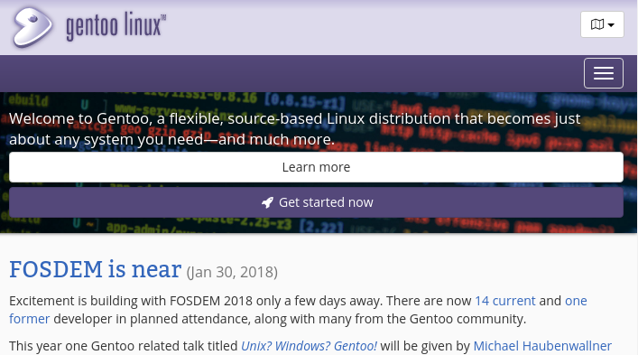

# History of HTML through Linux/BSD Websites

This is a breif overview of HTML versions examplified with some Linux/BSD websites.

All the screen shots are captured on 2018-02-20.

## Slackware


Slackware still uses tarballs for packaging,
and its website is also old-fashioned,
with html tags captalized,
using tables for layout. 

```html
<HTML>
<TITLE>
The Slackware Linux Project</TITLE>
<BODY BACKGROUND="/grfx/shared/background.jpg" BGCOLOR="#fefefe"
		         TEXT="#000000" LINK="#000000" VLINK="#000000"
		         ALINK="#000000">
<CENTER>

<TABLE BORDER="0" WIDTH="85%" CELLSPACING="0" CELLPADDING="0">
<TR>
	<TD COLSPAN="3">
		<TABLE WIDTH="95%" CELLSPACING="0" CELLPADDING="0">
		<TR>
			<TD ALIGN="center" VALIGN="bottom" WIDTH="55%">
				<TABLE WIDTH="80%" CELLPADDING="0"><TR><TD BGCOLOR="#000000">

	      <TABLE WIDTH="100%" CELLPADDING="6">
	      <TR><TD BGCOLOR="#fefefe">
				<CENTER><B>
				The Slackware Linux Project				</B></CENTER>
				</TD></TR></TABLE>
</TD></TR></TABLE>			</TD>
			<TD VALIGN="bottom" ALIGN="right">
				<TABLE CELLPADDING="0"><TR><TD BGCOLOR="##000000">
				<TABLE CELLPADDING="0"><TR><TD BGCOLOR="#ffffff">
				<A HREF="/index.html"></A>				</TD></TR></TABLE>
				</TD></TR></TABLE>
			</TD>
		</TR>
      <TR>
         <TD COLSPAN="2"><BR></TD>
      </TR>
		</TABLE>
	</TD>
</TR>
<TR VALIGN="top">
	<TD WIDTH="10%">
		<TABLE WIDTH="100%" CELLPADDING="0"><TR><TD BGCOLOR="#000000">

	      <TABLE WIDTH="100%" CELLPADDING="14">
	      <TR><TD BGCOLOR="#fefefe">
<FONT SIZE="-1"><B>
<A HREF="/index.html">News</A><P>
</B></FONT>
</TD></TR></TABLE>
</TD></TR></TABLE><TABLE WIDTH="100%" CELLPADDING="0"><TR><TD BGCOLOR="#000000">

	      <TABLE WIDTH="100%" CELLPADDING="14">
	      <TR><TD BGCOLOR="#fefefe">
<FONT SIZE="-1"><B>
<A HREF="/security/">Security Advisories</A><P><A HREF="/faq/">FAQ</A><P><A HREF="/book/">Book</A><P><A HREF="/info/">General Info</A><P><A HREF="/getslack/">Get Slack</A><P><A HREF="/install/">Install Help</A><P><A HREF="/config/">Configuration</A><P><A HREF="/packages/">Packages</A><P><A HREF="/changelog/">ChangeLogs</A><P><A HREF="/~msimons/slackware/grfx/">Propaganda</A><P><A HREF="/ports/">Ports</A><P><A HREF="/links/">Other Sites</A><P><A HREF="/support/">Support</A><P><A HREF="/contact/">Contact</A><P><A HREF="/lists/">Mailing Lists</A><P><A HREF="/about/">About</A></B></FONT>
```

## Debian


As one of two oldest Linux distributions still alive today,
(the other is Slackware),
Debian is also quite old fashioned.
Its website uses HTML 4.01.
However, the Debian website uses HTML 4.01 Strict,
instead of HTML 4.01 Transitional (used to be much more popular).
Debian is famous for its strictness on software licences.
I do not think these two factors are related. ;-)

```html

<!DOCTYPE HTML PUBLIC "-//W3C//DTD HTML 4.01//EN" "http://www.w3.org/TR/html4/strict.dtd">
<html lang="en">
<head>
  <meta http-equiv="Content-Type" content="text/html; charset=utf-8">
  <title>Debian -- The Universal Operating System </title>
  <link rel="author" href="mailto:webmaster@debian.org">
  <meta name="Description" content="Debian is an operating system and a distribution of Free Software. It is maintained and updated through the work of many users who volunteer their time and effort.">
  <meta name="Generator" content="WML 2.0.12 (16-Apr-2008)">
  <meta name="Modified" content="2018-02-20 03:50:42">
  <meta name="viewport" content="width=device-width">
  <meta name="mobileoptimized" content="300">
  <meta name="HandheldFriendly" content="true">
<link rel="alternate" type="application/rss+xml"
 title="Debian News" href="News/news">
<link rel="alternate" type="application/rss+xml"
 title="Debian Project News" href="News/weekly/dwn">
<link rel="alternate" type="application/rss+xml"
 title="Debian Security Advisories (titles only)" href="security/dsa">
<link rel="alternate" type="application/rss+xml"
 title="Debian Security Advisories (summaries)" href="security/dsa-long">
<link href="./debhome.css" rel="stylesheet" type="text/css">
  <link href="./debian-en.css" rel="stylesheet" type="text/css" media="all">
  <link rel="shortcut icon" href="favicon.ico">
  <meta name="Keywords" content="debian, GNU, linux, unix, open source, free, DFSG">
<link rel="search" type="application/opensearchdescription+xml" title="Debian website search" href="./search.en.xml">
</head>
<body>
<div id="header">
   <div id="upperheader">
   <div id="logo">
  <a href="./" title="Debian Home"></a>
  </div> <!-- end logo -->
	<div id="searchbox">
		<form name="p" method="get" action="https://search.debian.org/cgi-bin/omega">
		<p>
<input type="hidden" name="DB" value="en">
			<input name="P" value="" size="27">
			<input type="submit" value="Search">
		</p>
		</form>
	</div>   <!-- end sitetools -->
 </div> <!-- end upperheader -->
```

## FreeBSD


FreeBSD website uses XHTML 1.0 Transitional with CSS.
However, it does not work well with small screens as shown above.
Ironically, Slackware website layouted with tables work well under small screens.

Compared to HTML 4.01, XHTML is quite "new".
However, these days no one cares about XHTML any more.
To some extent, this is just like that among the BSD families FreeBSD has the fastest paces of developing and integrating new technologies and features.
But outside the BSD family...

```html

<?xml version="1.0" encoding="iso-8859-1"?>
<!DOCTYPE html PUBLIC "-//W3C//DTD XHTML 1.0 Transitional//EN" "http://www.w3.org/TR/xhtml1/DTD/xhtml1-transitional.dtd">
<html xmlns="http://www.w3.org/1999/xhtml" xmlns:db="http://docbook.org/ns/docbook">
  <head>
    <title>The FreeBSD Project</title>
    <meta http-equiv="Content-Type" content="text/html; charset=iso-8859-1" />
    <link rel="shortcut icon" href="./favicon.ico" type="image/x-icon" />
    <link rel="stylesheet" media="screen,print" href="./layout/css/fixed.css?20130112" type="text/css" />
    <script type="text/javascript" src="./layout/js/google.js"></script>
  </head>
  <body>
    <div id="containerwrap">
      <div id="container">
        <span class="txtoffscreen"><a href="#content" title="Skip site navigation" accesskey="1">Skip site navigation</a> (1)
  <a href="#contentwrap" title="Skip section navigation" accesskey="2">Skip section navigation</a> (2)
</span>
        <div id="headercontainer">
          <div id="header">
            <h2 class="blockhide">Header And Logo</h2>
            <div id="headerlogoleft">
              <a href="." title="FreeBSD">
                
              </a>
            </div>
```

## Gentoo



The cutting edge Gentoo website uses HTML5.
By the way, another cutting edge Linux distribution Arch also uses HTML5 on its web site.

```html
<!DOCTYPE html>
<html>
  <head>
  <meta charset="utf-8">
  <title>Welcome – Gentoo Linux</title>
  <meta name="description" content="The website of Gentoo, a flexible Linux or BSD distribution.">
  <meta name="theme-color" content="#54487a">
  <meta name="viewport" content="width=device-width, initial-scale=1.0">
  <meta http-equiv="X-UA-Compatible" content="IE=edge">
  <meta property="og:title" content="Welcome – Gentoo Linux">
  <meta property="og:image" content="https://www.gentoo.org/assets/img/logo/gentoo-g.png">
  <meta property="og:description" content="The website of Gentoo, a flexible Linux or BSD distribution.">
  <meta name="twitter:image" content="https://www.gentoo.org/assets/img/logo/gentoo-g.png">
  <link rel="apple-touch-icon" href="https://www.gentoo.org/assets/img/logo/icon-192.png">
  <link rel="icon" sizes="192x192" href="https://www.gentoo.org/assets/img/logo/icon-192.png">
  <link href="https://assets.gentoo.org/tyrian/bootstrap.min.css" rel="stylesheet" media="screen">
  <link href="https://assets.gentoo.org/tyrian/tyrian.min.css" rel="stylesheet" media="screen">
  <link href="/assets/css/screen.css" rel="stylesheet" media="screen">
  
  <link rel="icon" href="/favicon.ico" type="image/x-icon">
  <link rel="search" type="application/opensearchdescription+xml" href="https://www.gentoo.org/search/www-gentoo-org.xml" title="Gentoo Website">
  <link rel="search" type="application/opensearchdescription+xml" href="https://www.gentoo.org/search/forums-gentoo-org.xml" title="Gentoo Forums">
  <link rel="search" type="application/opensearchdescription+xml" href="https://www.gentoo.org/search/bugs-gentoo-org.xml" title="Gentoo Bugzilla">
  <link rel="search" type="application/opensearchdescription+xml" href="https://www.gentoo.org/search/packages-gentoo-org.xml" title="Gentoo Packages">
  <link rel="search" type="application/opensearchdescription+xml" href="https://www.gentoo.org/search/archives-gentoo-org.xml" title="Gentoo List Archives">
  <link rel="alternate" type="application/atom+xml" title="Gentoo Linux news" href="/feeds/news.xml">
</head>

  <body class="">
    <header>
  <div class="site-title">
    <div class="container">
      <div class="row">
        <div class="site-title-buttons">
          <div class="btn-group btn-group-sm">
            <a href="https://get.gentoo.org/" role="button" class="btn get-gentoo"><span class="fa fa-fw fa-download"></span> <strong>Get Gentoo!</strong></a>
            <div class="btn-group btn-group-sm">
              <a class="btn gentoo-org-sites dropdown-toggle" data-toggle="dropdown" data-target="#" href="#">
                <span class="fa fa-fw fa-map-o"></span> <span class="hidden-xs">gentoo.org sites</span> <span class="caret"></span>
              </a>
              <ul class="dropdown-menu dropdown-menu-right">
                <li><a href="https://www.gentoo.org/" title="Main Gentoo website"><span class="fa fa-home fa-fw"></span> gentoo.org</a></li>
                <li><a href="https://wiki.gentoo.org/" title="Find and contribute documentation"><span class="fa fa-file-text-o fa-fw"></span> Wiki</a></li>
                <li><a href="https://bugs.gentoo.org/" title="Report issues and find common issues"><span class="fa fa-bug fa-fw"></span> Bugs</a></li>
                <li><a href="https://forums.gentoo.org/" title="Discuss with the community"><span class="fa fa-comments-o fa-fw"></span> Forums</a></li>
```


